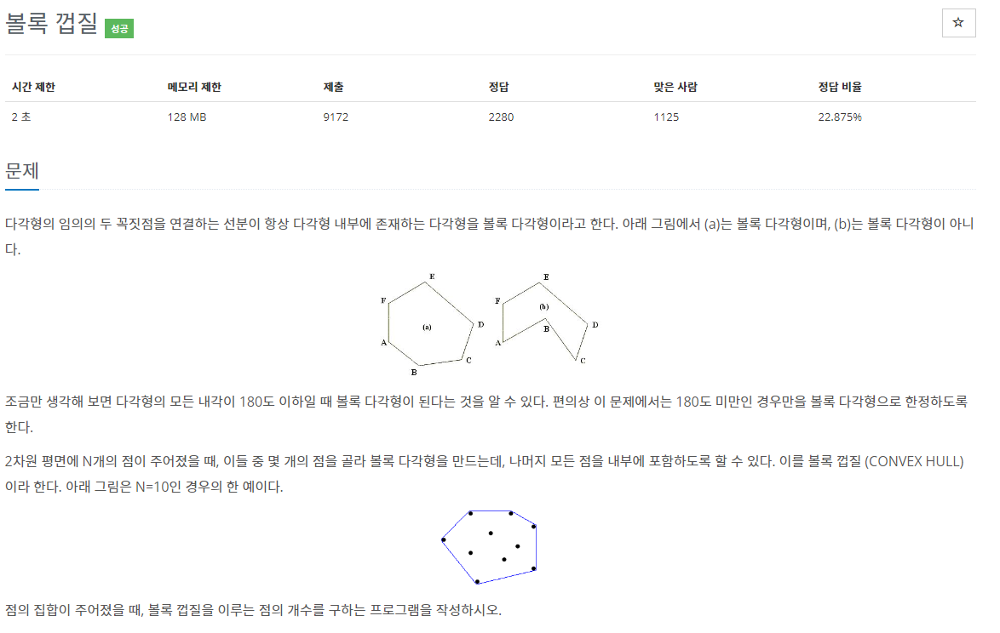
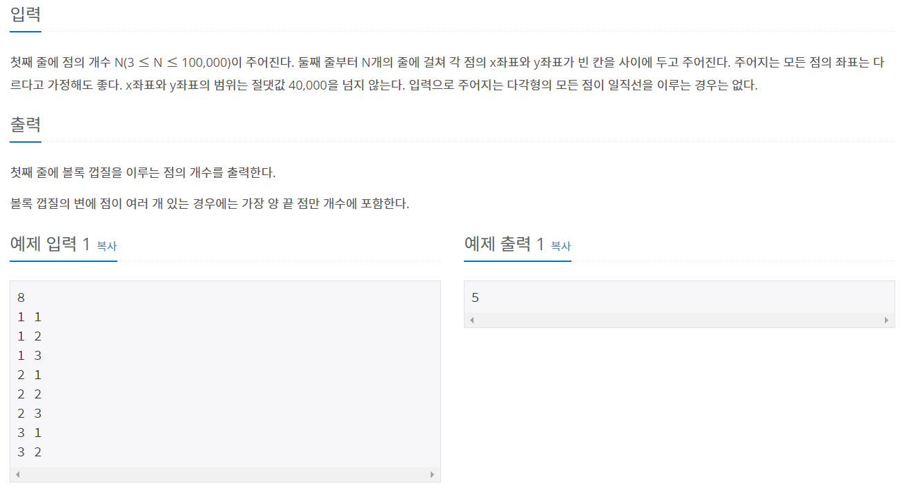

# BOJ 1708 - 볼록 껍질





### 문제 설명

여러 점들이 주어졌을 때, 그 점들로 구성되는 Convex Hall에 사용되는 점의 갯수를 구한다.


# 풀이


### Input 받기

우선 각 점을 객체로 표현하고, 필요한 정보를 각 객체에 넣어야 한다.  

고로 먼저 Point 라는 구조체를 선언한다.

```{c++}
struct Point {
    int x, y;
    int p, q; // p : dx // q : dy
    Point(int x1 = 0, int y1 = 0) : x(x1), y(y1), p(1), q(0) {}
};
```


x,y는 점의 좌표, p, q는 dx 와 dx를 각각 나타낸다.  

위 점들을 보관할 벡터를 선언한다.

```{c++}
#include <vector>
vector<Point> p;
```


해당 벡터에 input을 받은 후 넣는다

```{C++}
for (int i = 0; i < n; i++) {
    int x, y;
    scanf("%d %d", &x, &y);

    p.emplace_back(x, y);
}
```


### 정렬하기

위 점들을 정렬할 기준 2가지를 선언한다.

기준 1. 가장 왼쪽에 있는 것부터 정렬

```{c++}
// 좌하단 좌표 sort
bool comp1(const Point &A, const Point &B) {
    if (A.y != B.y)
        return A.y < B.y;
    return A.x < B.x;
}
```


기준 2. 반시계방향으로 정렬

```{c++}
// 반시계방향 sort
bool comp(const Point &A, const Point &B) {
    if (1LL * A.q * B.p != 1LL * A.p*B.q)
        return 1LL * A.q * B.p < 1LL * A.p * B.q; // 
 
    if (A.y != B.y)
        return A.y < B.y;
 
    return A.x < B.x;
}
```


우선 x,y 좌표순으로 정렬하여 기준점을 찾은 후 (여기선 p[0])

나머지 점들에 대해 각도 순으로 정렬한다.

```{C++}
sort(p.begin(), p.end(), comp1); // 이건 그냥 좌하단의 좌표를 p[0]으로 찾기 위함
    
for (int i = 1; i < n; i++) {
    p[i].p = p[i].x - p[0].x;
    p[i].q = p[i].y - p[0].y;
}
 
sort(p.begin() + 1, p.end(), comp); // 각도에 대해 sort
```


### 좌회전 판단하기

```{C++}
ll ccw(const Point &A, const Point &B, const Point &C) {
    return 1LL * (A.x*B.y + B.x*C.y + C.x*A.y - B.x*A.y - C.x*B.y - A.x*C.y);
}
```

위 값이 0보다 크면 좌회전이고, 아니면 일직선이거나, 우회전이다.

리턴값이 매우 커질 수 있으므로 long long으로 선언하는 것이 좋다.


### Graham Scan


몇번째 점이 Convex Hull을 구성하는지를 나타내는 Stack을 선언하고,

첫번째, 두번째 element를 순서대로 넣는다.

```{c++}
stack<int> s;
s.push(0);
s.push(1);
```


vector의 2번째 element부터 맨 마지막 element 까지 for문을 돌린다.

매 iteration 마다 가장 최근에 추가한 점 2개와, 새로 추가할 점 1개로 방향을 확인해야 한다.

Stack에 항상 2개 이상의 Point가 있어야 알고리즘을 쓸 수 있다.

고로 s.size() > 2 일 때만 맨 위의 점을 꺼내고, 그 다음 점은 Stack peek 하고

새로운 점을 이용하여, 세 점이 counterclockwise하면 새 점을 넣어준다.

```{c++}
while (next < n) {
    while (s.size() >= 2) {
        int first, second;
        second = s.top();
        s.pop();
        first = s.top();

        if (ccw(p[first], p[second], p[next]) > 0) {
            s.push(second);
            break;
        }
    }

    s.push(next++);
}
```


최종적으로 추가된 점의 갯수는 곧  

stack에 남아있는 점의 갯수와 일치하게 된다.  
