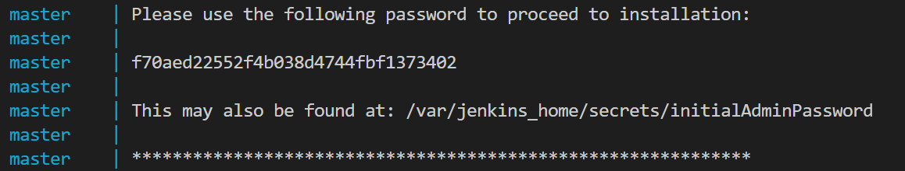

# Docker tutorial step 1


### 도커 이미지와 컨테이너 기본

1. 원격 저장소의 이미지 받아오기

```shell
docker image pull gihyodocker/echo:latest
```


2. 도커 컨테이너 생성

```shell
docker container run -t -p 9000:8080 gihyodocker/echo:latest
```

내부 8080 포트를 외부 9000으로 포트포워딩 했으므로 http://localhost:9000 으로 접속하여 확인해본다. (잘됨)


3. 도커 컨테이너 정지시키기

```shell
docker stop $(docker container ls -q)
```

-q 태그는 컨테이너의 numeric ID만 리턴하기 때문에 $()에 해당 컨테이너가 대입되어 멈추게 된다.


### 도커 이미지 만들기 

아주 단순한 http 응답 해주는 go 코드를 하나 작성해 보았다.

```go
package main

import (
	"fmt"
	"log"
	"net/http"
)

func main() {
	http.HandleFunc("/", func(w http.ResponseWriter, r *http.Request) {
		log.Println("received request")
		fmt.Fprintf(w, "Hello Docker!!")
	})

	log.Println("start server")
	server := &http.Server{
		Addr: ":8080",
	}
	if err := server.ListenAndServe(); err != nil {
		log.Println(err)
	}
}
```


이제 이걸 실행해주는 컨테이너를 만들기 위해 먼저 도커 이미지를 만들어주는 Dockerfile을 작성해보자.


```dockerfile
FROM golang:1.9

RUN mkdir /echo
COPY main.go /echo

CMD ["go", "run", "/echo/main.go"]
```


**FROM** - 도커 이미지의 바탕이 될 베이스 이미지를 지정한다. Dockerfile로 이미지를 빌드 할 때 먼저 FROM 에서 지정된 이미지를 받는다. 

여기서 받는 이미지는 도커 허브에 공개된 것이며, 기본적으로 도커 허브 레지스트리를 참조한다.

**RUN** - 도커 이미지를 실행할 때 컨테이너 내에서 실행할 명령을 정의한다.

**COPY** - 호스트 머신의 파일이나 디렉토리를 도커 컨테이너 안으로 복사한다.

**CMD** - 도커 컨테이너를 실행 할 때 컨테이너 내에서 실행할 프로세스를 지정한다.


#### 이미지 빌드하기

```shell
docker image build -t example .
```

이미지의 이름을 example로, . 디렉토리에 있는 (현재 디렉토리) Dockerfile에 작성된 대로 빌드하는 것.

실행하면 해당 Dockerfile 에 작성된 step 대로 수행된다.


#### 포트 포워딩

애플리케이션 내에서 선언한 포트는 컨테이너 안에 한정된 '컨테이너 포트' 여서, 컨테이너 외부의 요청을 컨테이너 내부로 전달해주어야 한다. 이 역할을 하는 것이 **포트포워딩** 이다.  -p 9000:8080 라고 작성하면, 내부 포트 8080을 호스트 포트 9000으로 접근할 수 있게끔 포트포워딩을 해주는 것이다.

호스트 포트를 생략할 경우 자동으로 'ephemeral port' 를 지정해준다.


#### 도커 이미지 빌드

```shell
docker image build -t <이미지명> <도커파일경로>
```

이게 기본이다. 여기서 추가적인 옵션들을 살펴보자.

- image build -f(find): 입력한 디렉토리에서 해당 파일명의 도커파일을 찾아서 사용하라는 뜻
- image build --pull=true: FROM 명령어에서  로컬에 캐시된 버전을 사용하는 것이 아닌 새로운 베이스 이미지를 강제로 가져옴. 원래 default는 로컬에 있는 이미지를 캐시하여 사용함. 없으면 원격 이미지를 사용.


#### 기타 유용한 명령어들

- docker image pull: 레지스트리에서 이미지를 내려받음.

- docker search --limit <갯수> <이미지 이름> : 해당 검색한 이미지 이름과 관련된 리포지토리 목록을 볼 수 있다.
- docker image ls: 보유한 도커 이미지 목록 확인 (호스트 환경에 있는 이미지들)
- docker image tag: 이미지에 태그 부여하기
  - 가장 최근에 빌드한 이미지는 latest라는 태그가 붙어있음.
- docker image push: 도커 허브 등의 레지스트리에 등록함.


### 도커 컨테이너 다루기

컨테이너의 라이프사이클

- 실행 중 
  - CMD 혹은 ENTRYPOINT 명령어에 정의된 애플리케이션이 실행됨.
- 정지
  - 컨테이너 내에서 실행된 애플리케이션이 종료된 경우에 컨테이너가 자동으로 종료된다.
- 파기
  - 삭제된 거임.


#### 컨테이너 생성 및 실행

```shell
docker container run [options] <이미지명>:<태그> [명령] [명령인자...]
```


옵션들

- --name : 컨테이너에 이름을 붙여준다. 주로 개발용으로만 사용, 운영에서는 잘 사용되지 않음.

- -d (detach) : 컨테이너를 백그라운드에서 실행

- -p (port) : 포트 포워딩 
- -i (interactive) : 컨테이너의 표준 입력과 연결을 유지, 컨테이너 쪽 셸에 들어가서 명령을 실행할 수 있게 해줌.
- -t (terminal) : 유사 터미널 기능을 활성화 한다.
- --rm(remove) : 컨테이너를 종료할 때 컨테이너를 파기
- -v : 호스트와 컨테이너 간에 디렉터리나 파일을 공유하기 위해 사용한다.


#### 컨테이너 목록 보기

```shell
docker container ls [options]
```

항목들

- CONTAINER ID : 컨테이너를 식별하는 ID
- IAMGE : 컨테이너를 만들때 사용된 도커 이미지
- COMMAND : 컨테이너에서 실행되는 애플리케이션 프로세스
- CRAETED : 컨테이너 생성 후 경과된 시간
- STATUS : 컨테이너의 실행 상태 (Up : 실행중, Exited : 종료)
- PORTS : 포트 포워딩 상태 (호스트와 컨테이너 간 포트 연결 상태)

- NAMES : 컨테이너의 이름


옵션들

- -q : 컨테이너의 ID만 추출하여 반환함.

- --filter "필터명=값" : 해당 조건을 만족시키는 컨테이너의 목록을 반환
  - name : 이름, ancestor : 컨테이너를 생성한 이미지 // 등등 필터링 조건들은 다양하다. 
- -a : 종료된 컨테이너 목록 보기


#### 기타 컨테이너 관련 명령

- docker container stop [컨테이너 ID or 이름] : 컨테이너를 정지한다.
- docker container restart  [컨테이너 ID or 이름] : 컨테이너를 재시작한다.
- docker container rm [컨테이너 ID or 이름] : 컨테이너를 제거한다.
  - -f 를 주면 강제로 제거할 수 있다.
- docker container logs [options] [컨테이너] : 컨테이너의 표준 출력 내용을 보여준다.
  - 쿠버네티스가 컨테이너 로그를 수집해서 보여주기 떄문에 잘 안쓰게 될지도.

- docker container exec [options] [컨테이너] : 실행중인 컨테이너에서 명령 실행하기.
- docker container cp : 컨테이너와 호스트 간 파일을 복사함.
  - {컨테이너}:{파일명} [호스트 디렉토리 위치] 로 작성하면 컨테이너 -> 호스트
  - [호스트 파일명] [컨테이너]:[디렉토리위치] 로 작성하면 호스트 -> 컨테이너


#### 운영과 관리를 위한 명령

docker container prune - 실행중이 아닌 모든 컨테이너 제거

docker image prune - 태그가 붙지 않은 && 실행중인 컨테이너가 없는 모든 이미지를 삭제

docker system prune - 사용하지 않는 도커 리소스를 일괄적으로 삭제

docker container stats - 시스템 리소스 사용 현황을 컨테이너 단위로 확인할 수 있다.


### 도커 컴포즈로 여러 컨테이너 실행하기

단일 애플리케이션이 아닌 여러 컨테이너를 다루면서 의존성 까지 관리하려면 docker-compose를 사용하자.

```shell
// docker-compose.yml
version: "3"
services:
  echo:
    image: example:latest
    ports:
      - 9000:8080
```

docker-compose.yml을 이와 같이 작성한 후, docker-compose up 명령을 실행하면, 지정한 image에 포트를 바인딩한 서비스가 실행된다.

docker-compose down을 통해 지정한 서비스를 제거할 수 있다.

```shell
version: "3"
services:
  echo:
    build: .
    ports:
      - 9000:8080
```

이 경우는 현재 폴더에서 빌드 + 포트포워딩 + 실행 까지 한다. 도커 파일이 해당 폴더에 있는 경우이다. 이 경우 이미지를 빌드한 적이 있으면 빌드를 생략하는데, --build 옵션을 넣으면 강제로 다시 빌드한다.


**젠킨스 컨테이너 예시**

```shell
version: "3"
services:
  master:
    container_name: master
    image: jenkinsci/jenkins:2.142-slim
    ports:
      - 8080:8080
    volumes:
      - ./jenkins_home:/var/jenkins_home
```

volumes 항목은 호스트와 컨테이너 사이에 파일을 공유할 수 있게 해준다. Dockerfile의 COPY와는 다른 기능이다. 젠킨스를 처음 쓴다면, 이런 메세지를 확인하자.





localhost:8080로 접속할때 필요한 비밀번호이다. Install suggested plugins를 하고 admin 계정을 생성하면 대충 이런 화면이 뜬다.


젠킨스를 잘 몰라서, 젠킨스에 대한 예시는 여기까지만 작성하려고 한다. 