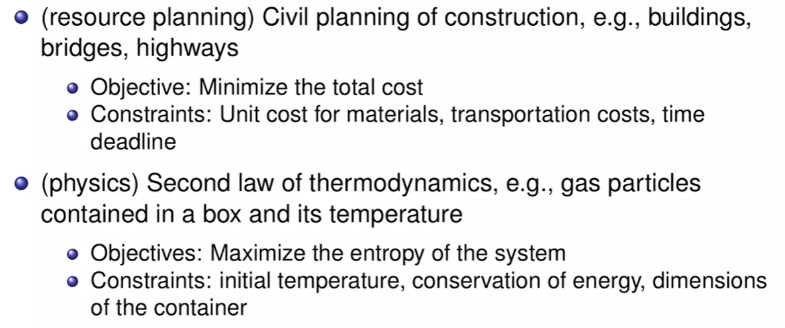

# Convex Optimization Lec 1

### Course Policy

- HW 는 맞으면 2점 틀리면 1점 안하면 0점
- 숙제 제출은 원래 오프라인 (10분 전에 제출하기)
- 숙제 제출 온라인은 데드라인까지
- 숙제 열심히 해라
- 중간 1회, 기말 1회. 수업시간에 지필로.

### Introduction

- Convex sets, Convex functions
- Convex Optimization problems
- duality
- algorithms
- application
- programming (python)
  - pytorch, jupyter notebook, CoLab
  - SGD, AdaGrad, RMSprop 등 구현

### What is Optimization problem?

- **To Minimize** an objective function **under certain constraints**
- 특정 영역에서 특정 함수를 최소화 하는 것이 목적이다.
- constraint에 따라 결과가 달라진다.
- 엔지니어링은 결국 제한된 리소스 내에서 최적화 하는것이다.

#### Example of Optimization 

- Training Neural Network For Classification
  - loss 함수를 정의하되, weight, layer, input dimension, output class 등의 constraint 가 있다.

등등 .. 다양한 경우가 있다.

