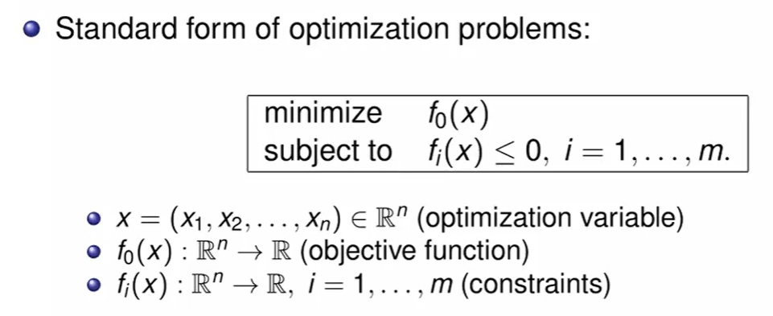
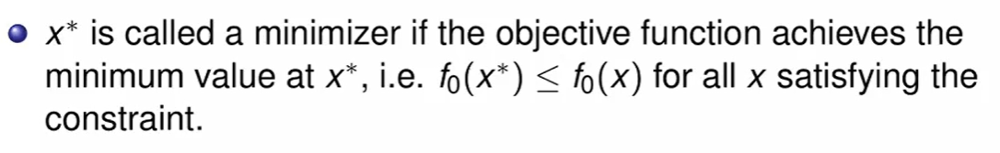
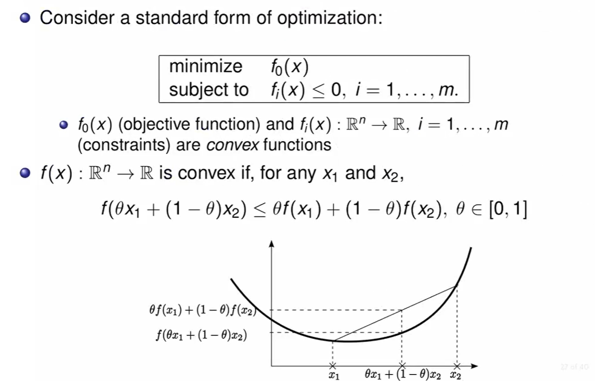
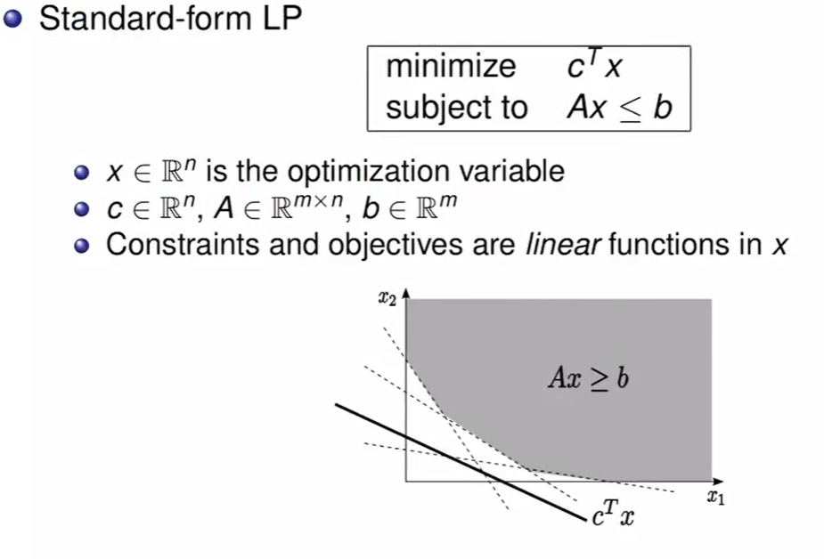
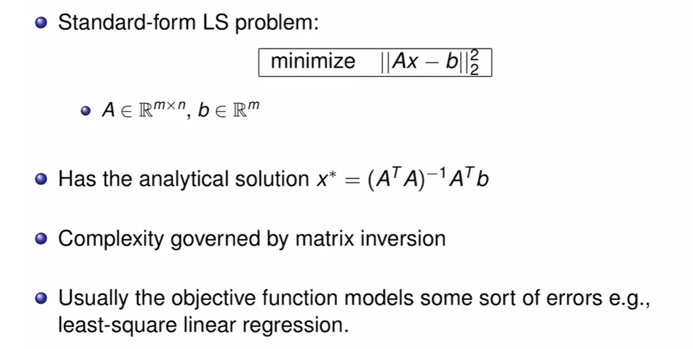
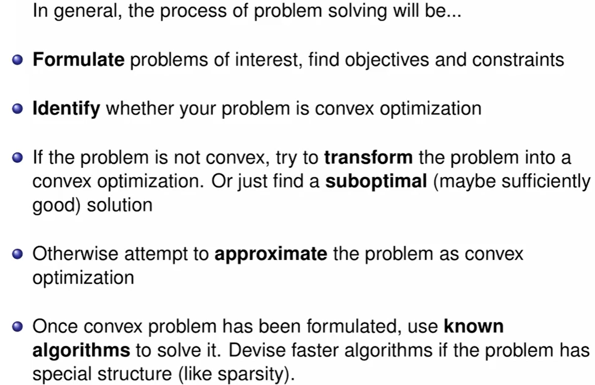

# Convex Optimization Lec 2

### Solving Problems

- 대부분 Numerical 하게 해결
- 최적화 문제는 일반적으로 해결하기 어려움 
  - 풀 수 없다.
  - 푸는 방법은 아는데 너무 오래 걸린다 (NP hard 같은거)
- 그치만 대부분의 볼록 최적화 문제는 해결하는 알고리즘이 알려져있다
- 최적화 문제를 보고, 이게 볼록 최적화 문제인지 구별하는게 매우 중요하다.

### Standard form of Optimization problem

여러 variable x에 대해 fi(x) <= 0인 영역에서 f0(x) 를 최소화하라는 구조가 일반적인 최적화 문제.

예를 들어 를 x가 0이상 2이하 인 영역에서의 최소값을 구하는 문제면, f0은 당연히 알거고, fi(x)는 -x 랑 x -2 로 나뉠 것이다. 

minimizing 하는 x를 x* 라고 부를 것이다.

### Standard form of Convex Optimization problem

- Convex Optimization 의 standard form은, 최적화 문제의 모든 함수가 convex function 인 경우이다. 

- convex function의 정의는 다음과 같다. (두 점 잡고 평균값이 그 사이의 임의의 함수값이 평균값보다 크거나 같다)

### Example : Linear Programming

Linear programming은 Optimization Problem에서 **목적함수와 제약함수가 모두 1차함수로** 되어있는 경우이다.

밑의 이미지를 보면, 여러 제약조건의 직선이 가능한 영역을 제약하고, 그 때 목적함수의 최솟값을 구하라고 한다. 이 문제는 기하학적으로 매우 단순해서, 그냥 접하게끔만 하면 된다.

- LP는 단순해보이지만, analytical solution이 없다.
- **수많은 문제를 LP로 변형할 수 있다.**

### Least Square Problem

- 2차식에 대한 최적해 구하는 문제
  - Analytical Solution이 존재한다 (이건 예전에 수치해석때 배운듯)
  - least-square linear regression 에서의 Object function

- 주로 임의의 점으로부터 iterative하게 움직여서 찾아감. 
  - 현재 상태에서 제일 가파른 방향으로 Greedy한 접근을 반복
  - 그러다 언젠간 극점에 도달

일반적으로 문제를 해결하는 과정

- objective와 constraint를 찾기
- problem이 convex 한지 확인하기
- convex하지 않으면 convex하게끔 변형하던지, suboptimal 한 solution을 그냥 채택하던지.
- 그게 아니면 convex로 근사한 문제를 풀자. 