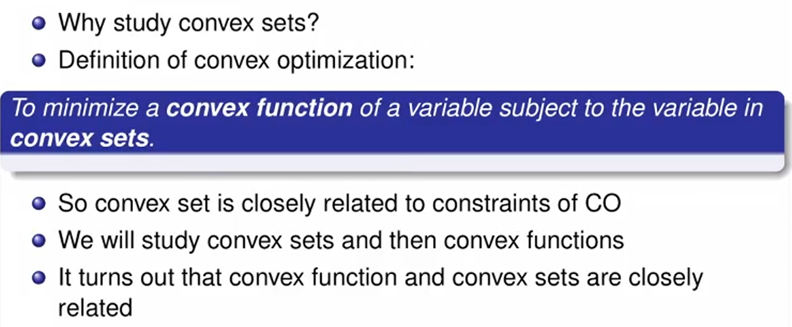
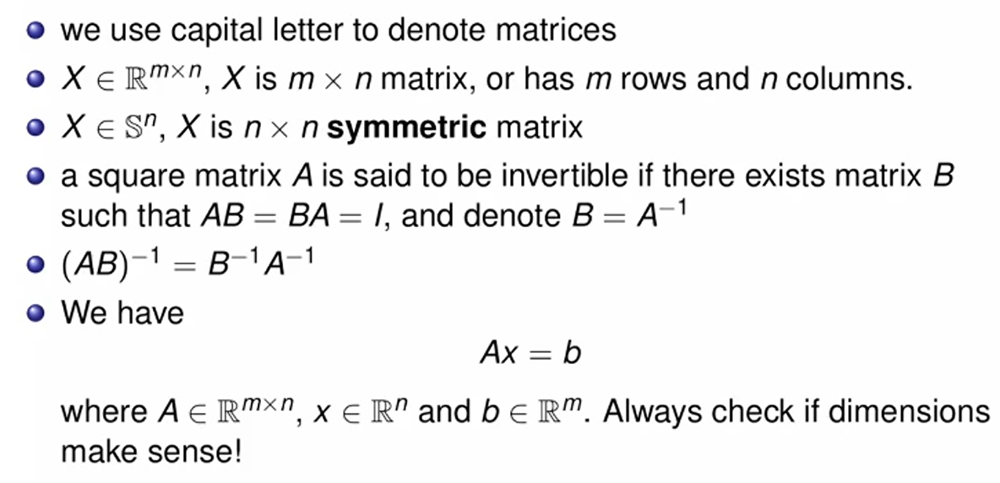
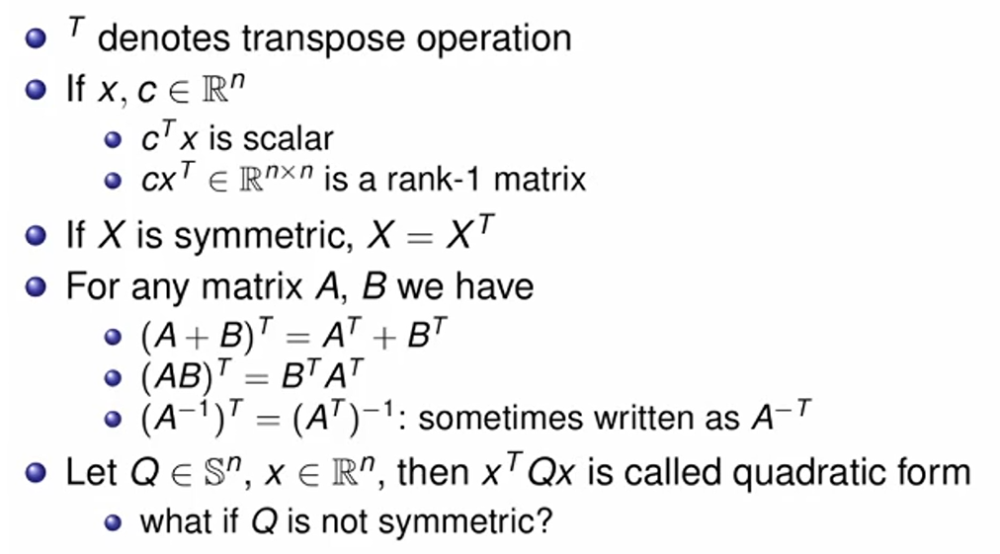
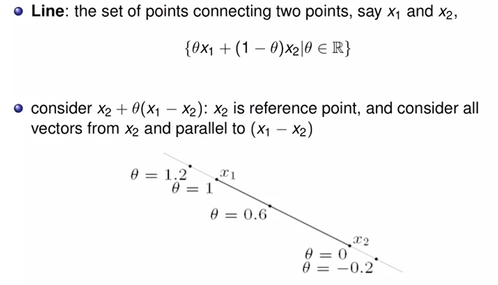
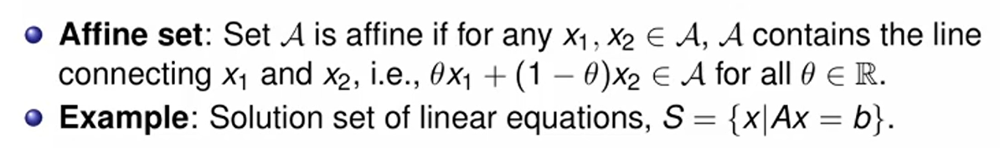
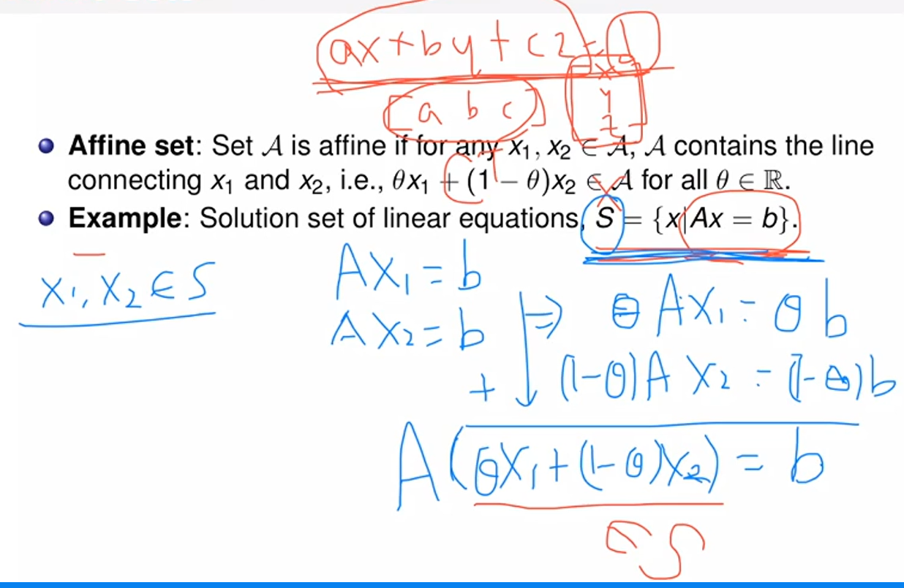
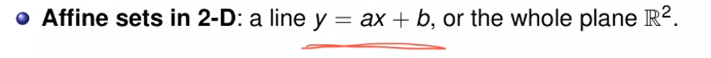

# Convex Optimization Lec 3

### Convex Sets

- 이전에 Convex Optimization에 대해서 정의를 내렸을 때, 최적화 문제에서 함수가 convex function인 경우라고 이야기 했지만, 실제로는 variable이 convex set 안에 존재해야 한다.

- Convex function과 set은 상호적으로 정의할 수 있는 밀접한 관계

**Notation**

**x는 column vector다.**

**당연한 이야기들이다. ** Matrix 간 곱할 때 Dimension 맞는지 잘 확인을 합시다.

- Q가 Symmetric 하지 않으면 ? Symmetric Form의 합으로 변형할 수 있다. (이부분 다시 확인)

  

- Affine set -> 해당 집합의 두 원소에 대해, 두 원소의 모든 Linear combination이 해당 집합에 포함되는 집합
  - 선, 평면, 공간 이 이에 해당함.

밑의 Example이 Affine Set임을 증명하는 내용

그럼 half plane은 affine set일까? No.