# Convex Optimization Lec 4

**Convex set**을 정리하기 위해 기하학적 개념들을 배우는 중

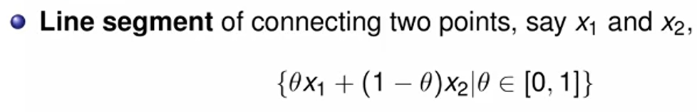

**Line Segment는 두 점의 내분점들의 집합이라고 생각하면 된다 (양 끝점을 포함함)**

- 두 점의 **Linear Combination** 으로 구성됨 (대신 theta의 범위가 제한됨)

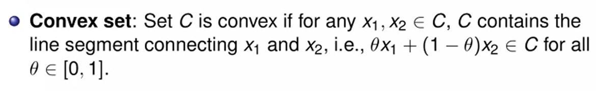

- **Convex set** 이라는 건, 집합 내의 임의의 두 점을 잡았을 때, 그 두 점에 대한 Line Segment 가 집합에 포함되는 집합을 의미함.

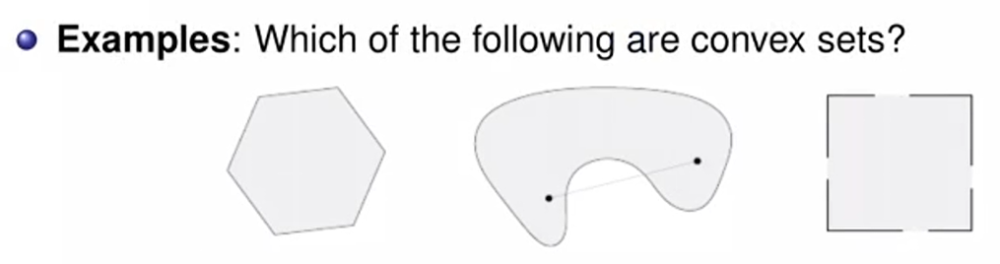

- 첫번째 육각형은, 임의의 두점을 아무데나 잡아도 line segment를 만족하겠지.
- 두번째는 저렇게 점을 찍었을 때 어떤 점들이 포함이 안되니까 안되고
- 세번째도 가장자리 두점 잡을 때 포함 안되는 경우가 있을거니까 안된다.

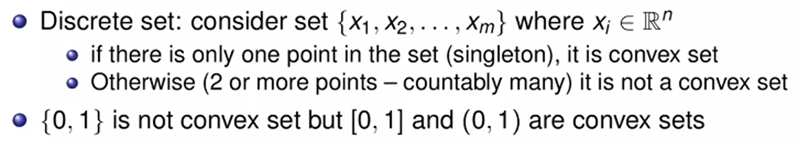

- Discrete set 은 항이 1개가 있지 않은 이상 절대 convex set이 될 수 없다. 중간 값들이 반영되지 않기 때문

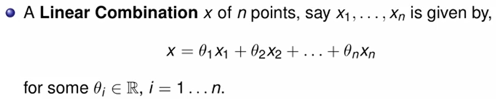

- **Linear  Combination**의 개념은 각 벡터들의 Linear Sum이다. theta는 scalar

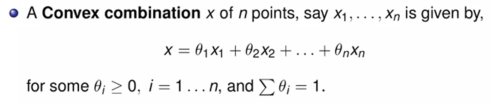

- **Convex Combination** 은 모든 계수가 0보다 크며, 계수의 합이 1인 것 
  - 내분점들의 집합이 나타날 것

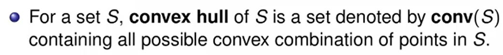

- **Convex hull** 은 집합 S 안에 있는 모든 점을 포함하는 convex를 이루는 점의 집합을 의미함.

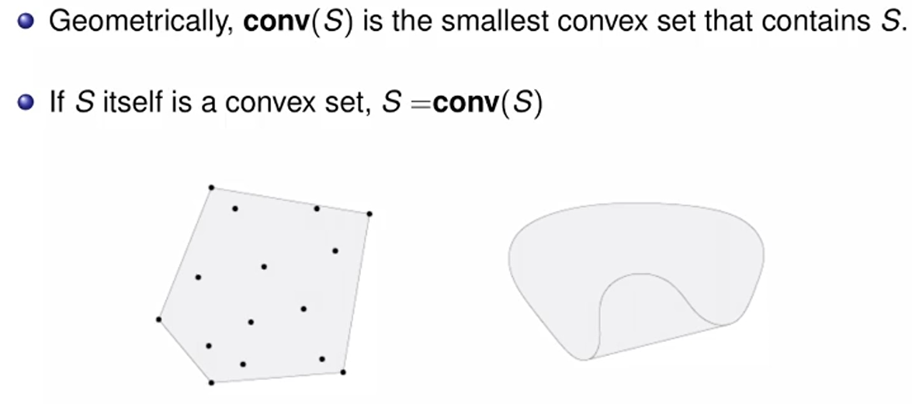

- S 자체가 Convex set이면 자기 자신이 conv(S)
- 우측의 움푹 파인 도형에 대한 convex hull은, 가장자리 + 움푹 파인 영역을 직선으로 채운 것이 된다.

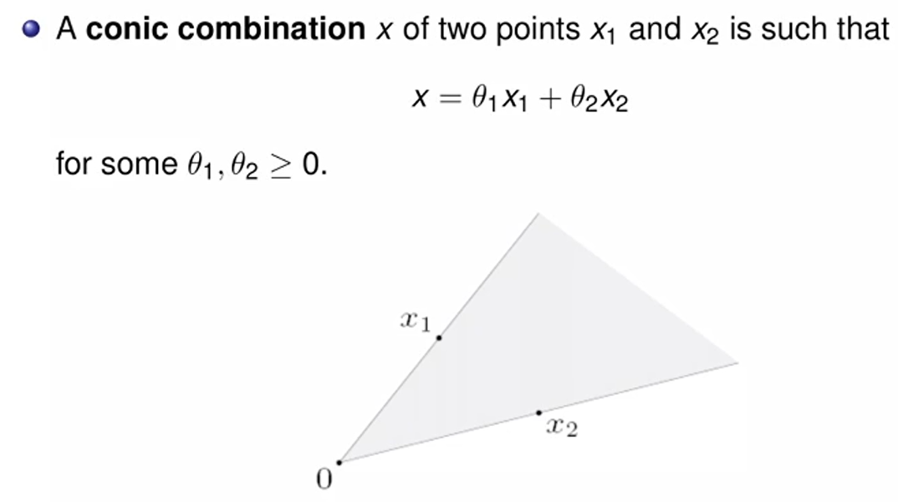

- **Conic Combination** - x1 , x2의 linear combination 중 계수가 0보다 큰것들 
  - x1 x2가 각각 벡터고, 계수에 의해 벡터 공간의 지점이 정해진다. 

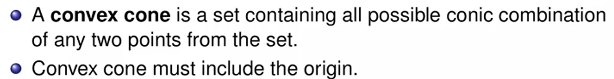

- **Convex cone** 은 집합인데, 임의의 두 지점에서 conic combination이 집합에 포함되는 집합이다.
- convex cone은 무조건 원점을 포함한다.

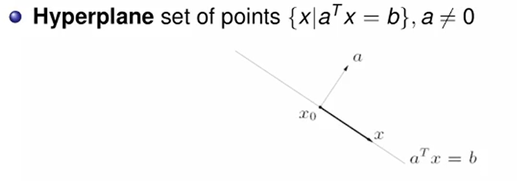

- **Hyperplane** - 평면을 생각하면 됨. aT(x - x0) = 0 이니까, aT 랑 (x - x0) 라는 벡터가 수직이면 만족하기 떄문에..
- Hyperplane은 affine 하면서 convex 하다.

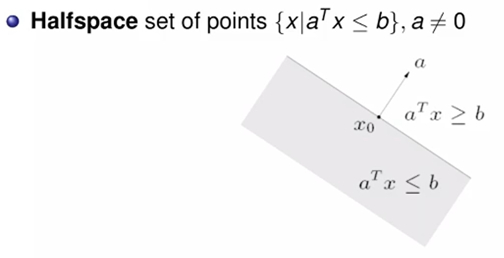

- **Halfspace** - 평면 밑부분

- acute 하면 예각, 내적이 0보다 크고, 둔각이면 내적이 0보다 작음 (방향이 반대니까)

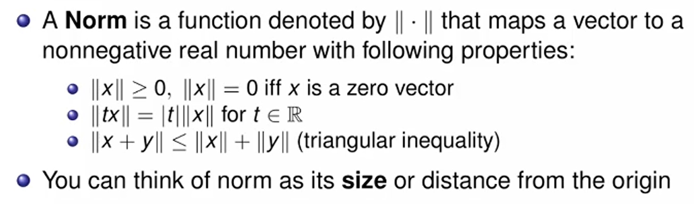

**Norm** 은 벡터를 받아 스칼라 값을 주는 일종의 함수. 벡터의 size 혹은 origin 과의 거리 정도로 생각하면 된다.

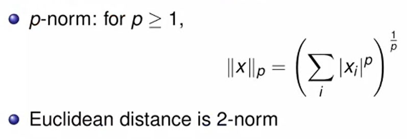

p 값에 따라 norm이 달라짐. 2일때 ruclidean distance

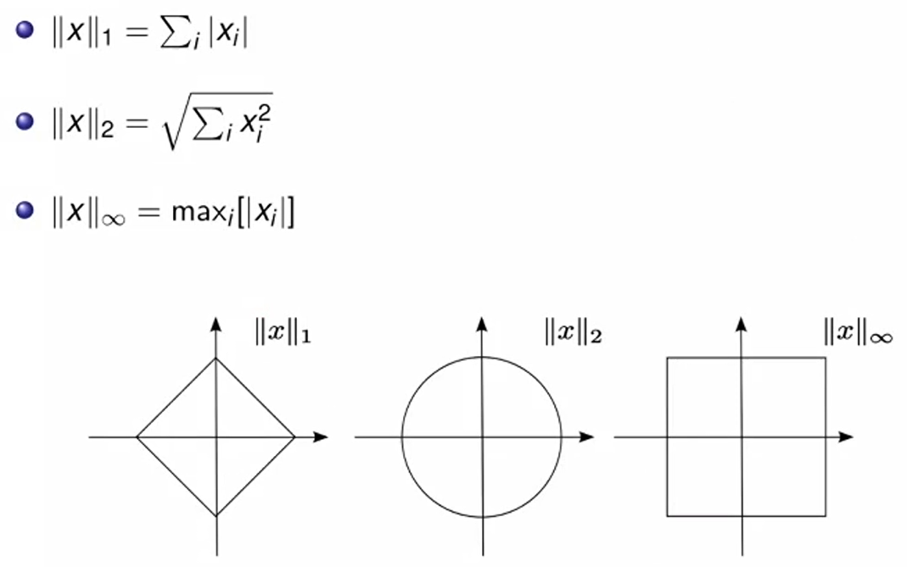

가장 흔하게 쓰는 P 값 : 1, 2, inf

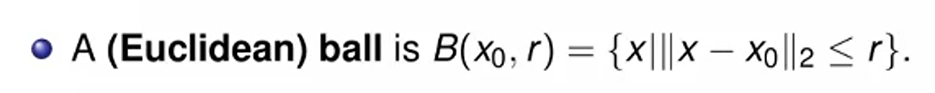

- 애는 그냥 원이다. x0 중심점, r 거리에 대한 ball은 x0으로부터의 norm이 2일때 크기가 r보다 작은.

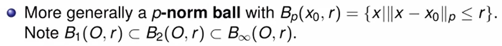

- 이와 같이 P norm을 기준으로 일반화 할 수 있다. p가 클수록 그 영역이 커진다.

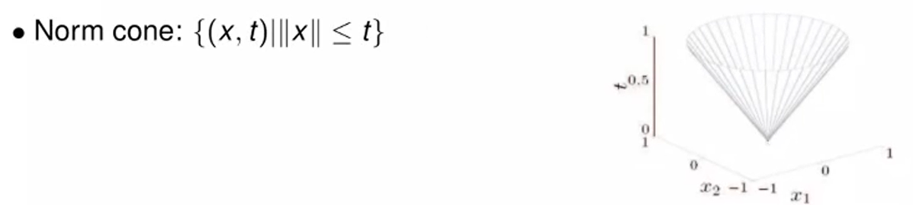

- n + 1 차원 dimension의 값인데, x의 크기가 t보다 작은 값들의 모임.

  - 간단히 n = 2 인 경우 저런식으로 표현이 될 것.
  - **cone과 ball은 convex set이다.**  

  

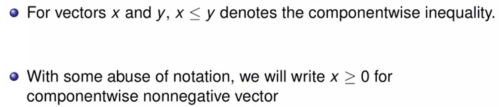

- **componentwise inequality**
  - 각 성분끼리 비교해서 한쪽 벡터가 모두 작을때 저렇게 부등호로 쓴다.

- **componentwise nonnegative** 
  - 그냥 모든 값이 0보다 크다는걸 명시해준거.

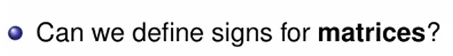

- Matrices 에 대해서 sign 을 이야기 할 수 있을까?

**Positive definite matrix**

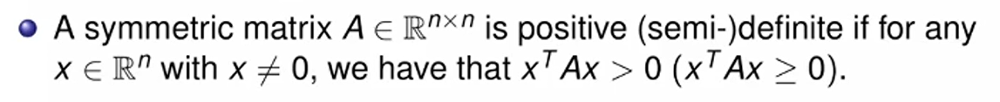

- 임의의 x에 대해 xTAx가 0보다 크면 A는 positive definite matrix

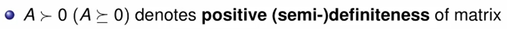

- 기호는 저렇게 생겼다.

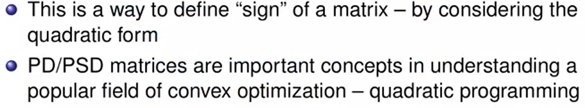

- quadratic form 에 대해 Matrix의 부호를 결정한다.

#### Positive Definite Matrix 에 관한 정의들

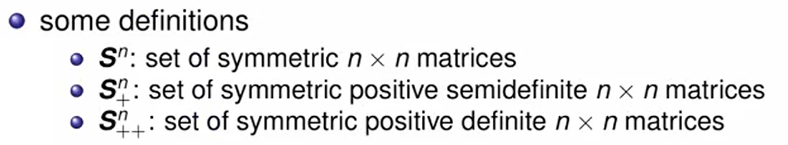

- S가 Symmetric matrix의 집합이면, 밑에 + 붙으면 positive definite.. 매우 단순하다. ++면 0도 뺀 양수집합.

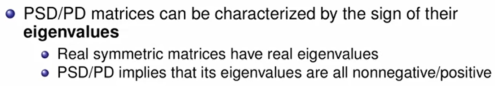

- PSD/PD는 eigenvalue가 nonnegative/positive

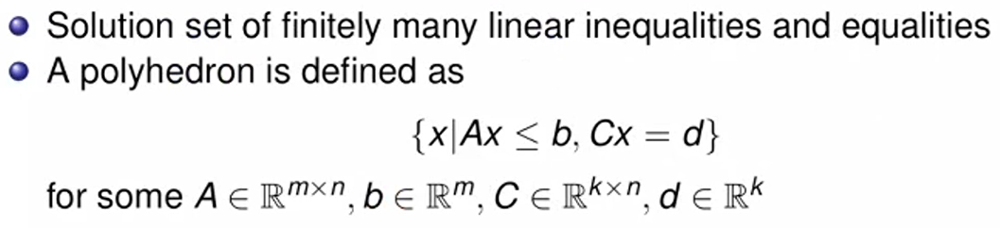

- **Polyhedra** 은 여러 halfspace의 중첩된 영역으로 구성됨.
- Polyhedra 는 convex 이다.

