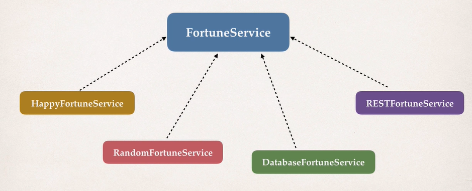

# Annotation


### Annotation 이란

- Java Class에 달린 특별한 label
- class의 Meta-data를 제공한다
- compile 시간 혹은 runtime에 처리된다.


#### Example


Override Annotation은 Parent class를 Override한다고 명시하는 것이다.

그럼 compile 시간에 Override가 valid한지 체크할 것이다.


**Why Configuration with Annotation?**

- XML 은 너무 길다
- Spring bean을 Annotation으로 관리 -> XML 을 최소화


**Scanning for Component Classes**

- Spring은 Java Class에 대해 특별한 annotation을 스캔해서, bean을 Spring container에 등록한다.


**Development Process**

1. Spring config file에 component scanning을 가능하게 설정한다.
2. Java Class에 **Component Annotation**을 추가한다 
3. Spring container 로부터 bean을 가져온다.


**Component** **Scanning 설정**

```xml
<context:component-scan base-package="annotation" />
```

위 설정을 xml에 추가해주자. base-package에 있는 컴포넌트들을 스캔할 것이다.


**Component Annotation을 한 Class 생성**

```java
package annotation;

import org.springframework.stereotype.Component;

@Component("thatSillyCoach")
public class TennisCoach implements Coach {

	@Override
	public String getDailyWorkOut() {
		return "Practice your backhand volley";
	}
}
```

이런식으로 Annotation과 Bean Id를 지정해주면 된다.


Main Class 를 작성하고 실행해보자.

```java
package annotation;

import org.springframework.context.support.ClassPathXmlApplicationContext;

public class AnnotationDemoApp {

	public static void main(String[] args) {
		
		// read spring config file
		ClassPathXmlApplicationContext context = new ClassPathXmlApplicationContext("applicationContext.xml");
		
		// get the bean from spring container
		Coach theCoach = context.getBean("thatSillyCoach", Coach.class);
		
		// call a method on a bean
		System.out.println(theCoach.getDailyWorkOut());
		
		// close the context
		context.close();
	}
}
```

잘 동작한다. bean의 정의 없이, Annotation을 통해 bean을 지정하였다.


bean의 이름을 지정하지 않으면, default name으로 해당 Class 의 첫번째 단어가 lowercase로 변경된 이름으로 지정된다.


#### DI with Annotation - constructor

- Autowired Annotation을 DI 하는 Constructor에 작성해주면 된다.

- Implementation이 다양한 경우엔 @Qualifier annotation을 이용한다.


```java
package annotation;
import org.springframework.stereotype.Component;

@Component
public class HappyFortuneService implements FortuneService {
	@Override
	public String getFortune() {
		return "Today is your lucky day";
	}
}
```

helper class 도 @Component annotation 넣고


```java
package annotation;

import org.springframework.beans.factory.annotation.Autowired;
import org.springframework.stereotype.Component;

@Component
public class TennisCoach implements Coach {

	private FortuneService fortuneService;
	
	@Autowired
	public TennisCoach(FortuneService fortuneService) {
		this.fortuneService = fortuneService;
	}

	@Override
	public String getDailyWorkOut() {
		return "Practice your backhand volley";
	}

	@Override
	public String getDailyFortune() {
		// TODO Auto-generated method stub
		return fortuneService.getFortune();
	}
}
```

Constructor 단에서 @Autowired 를 통해 자동으로 주입한다.

Target bean이 하나의 Constructor에만 정의되는 경우엔, 굳이 @Autowired를 쓰지 않아도 된다고 한다.


setter의 경우엔 setter에 @Autowired를 넣으면 setter를 통해 주입 될 것이다.


**Field Injection**

사실 그런거 다 필요없고 Field에 바로 @Autowired 설정을 넣으면 된다. **Java Reflection** 을 통해 의존성을 주입할 수 있다고 한다. 


주입 방식은 본인이 잘 선택에서 하면 됩니다. 대신 코드 자체는 일관성있게 짜야한다.


### Qualifier for Dependency Injection

- 어떤 Interface를 Autowired 하라고 했는데, 해당 Interface를 구현한 Class가 다양하면 어떤걸 선택하는질 어떻게 정하지?




이렇게 되면 어떤걸 Inject 해야 할지 감이 안오게 될 것이다. - NoUniqueBeanDefinitionException

그럼 그때는 Qualifier를 작성하여 Bean ID를 제공하면 된다. Constructor, Setter, Field 모두 사용 가능.


```java
@Autowired
@Qualifier("happyFortuneService")
private FortuneService fortuneService;
```

이런식으로 가는거임.

재는 Property Injection 일 때고, 생성자일 경우엔

```java
@Autowired
public void prepare(@Qualifier("main") MovieCatalog movieCatalog,
                    CustomerPreferenceDao customerPreferenceDao) {
```

이런식으로 가야한다.


#### Property File Injection 하는 방법

```
foo.email=myeasycoach@luv2code.com
foo.team=Silly Java Coders
```

대충 이런게 있다면, 

먼저 Component Scanning 먼저 설정해주고, 그 담에 property placeholder 설정을 해준다.

```
<context:component-scan base-package="annotation" />
<context:property-placeholder location="classpath:sport.properties"/>
```

```java
@Value("${foo.email}")
private String email;
    
@Value("${foo.team}")
private String team;
```

그리고 값은 Value annotation으로 Inject 해주면 된다.


------------


#### Bean Scope Annotation

- Bean scope는 Bean의 Lifecycle
- 일반적으로 Bean은 Singleton -> 하나의 Bean을 reference 함.

- @Scope("singleton") 이라고 써주면 그냥 Singleton Scope가 되는거임.


#### Bean Lifecycle Annotation

- @PostConstruct - 생성되기 이전에
- @PreDestroy - 사라지기 이전에

- 각각을 메소드의 Annotation으로 설정하면 됩니다.
- 일반적으로 메소드의 리턴은 void로 설정