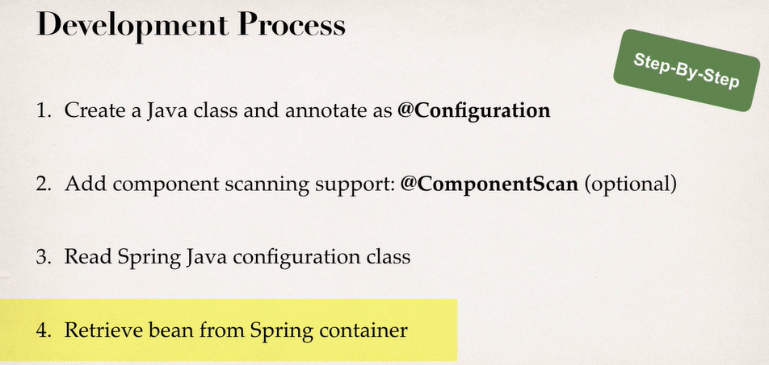
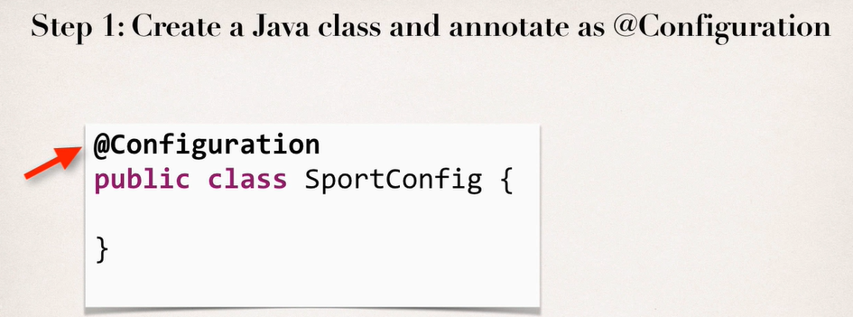
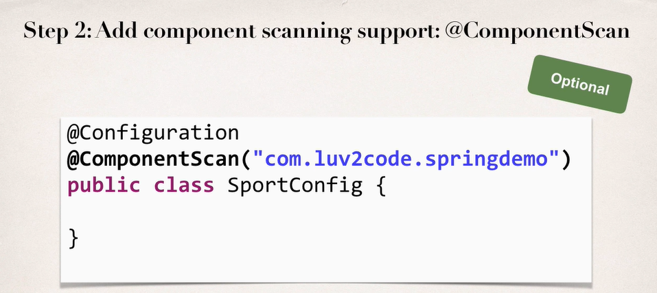
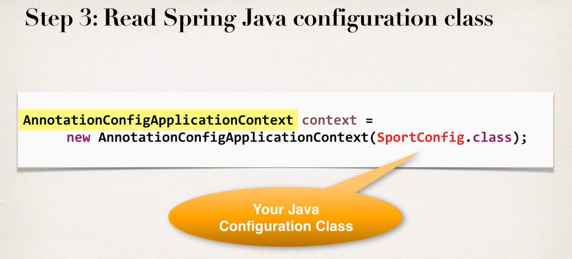
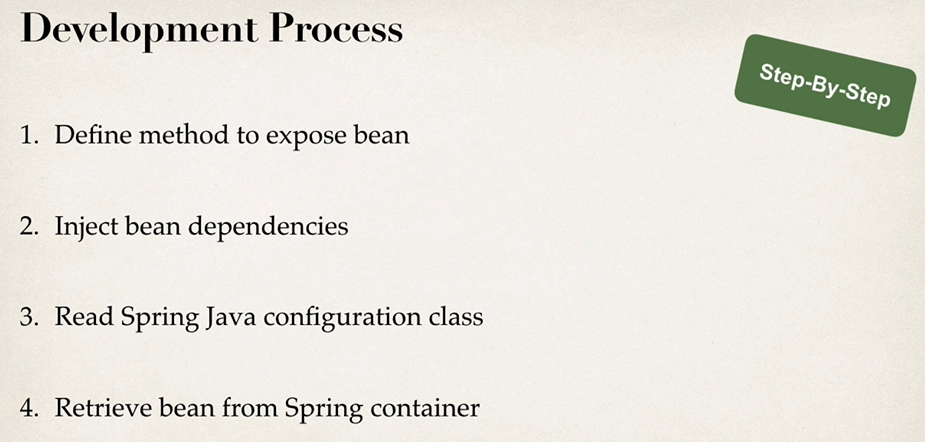
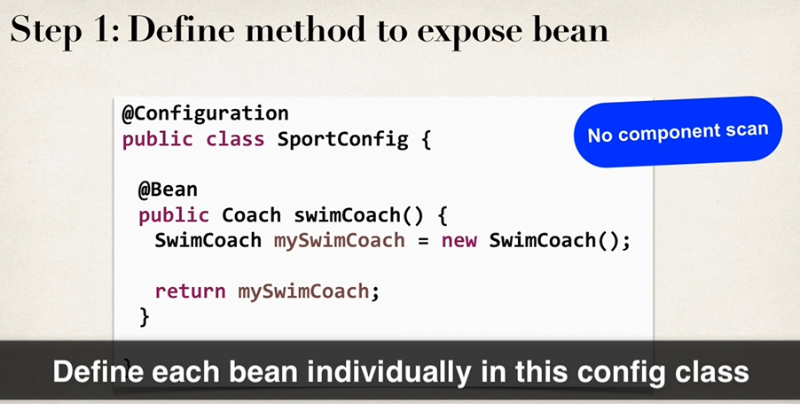
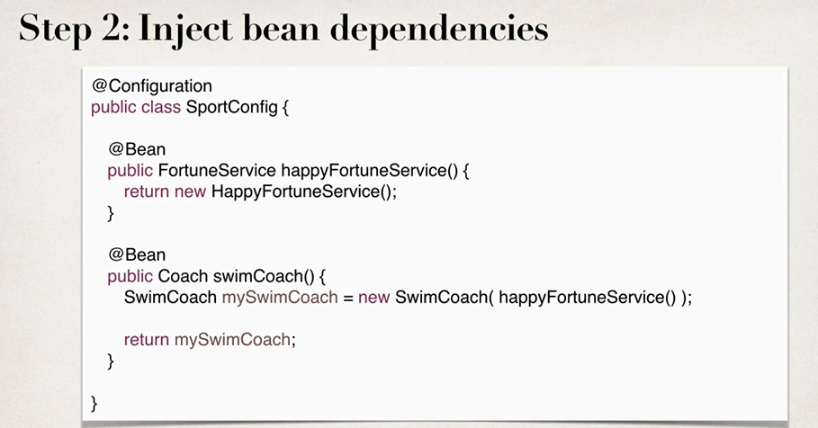
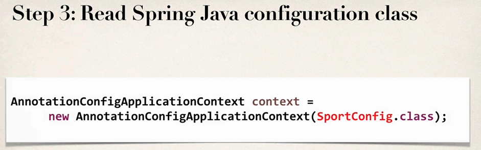
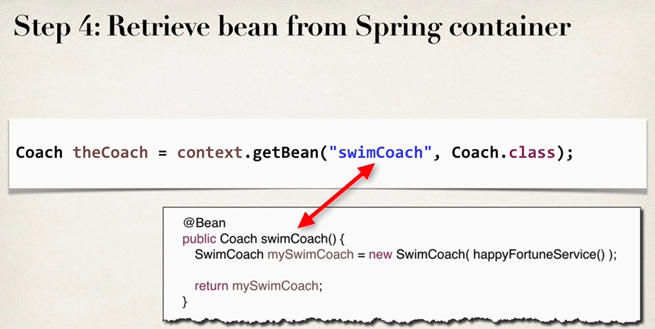

# Spring Configuration with Java Code

> xml이 아닌 Java Code로 Spring Bean 을 Configure 해보자.


Spring Container는 3가지 방식으로 설정 할 수 있다.

- Full XML Config
- XML Component Scan
- **Java Configuration Class**


이전에는 XML을 직접 작성해서 Config도 해보았고, Annotation을 이용한 XML Component Scan 도 해보았지만,

이번에는 Java Configuration Class를 이용해서 Bean 들을 관리해보자.




Java Class를 Configuration으로 Annotate 하고, Component Scanning Support를 추가한다 (Optional)

Spring Java Configuration class를 읽어 들인 후, Spring container에서 bean을 가져온다.




Configuration 용 Class임을 Annotation으로 명시한다




해당 package를 Scan 한다고 명시한다.




그다음 해당 Config Context를 넣으면 끝. 평소대로 Bean을 가져와서 사용하면 됩니다.


```java
package annotation;

import org.springframework.context.annotation.ComponentScan;
import org.springframework.context.annotation.Configuration;

@Configuration
@ComponentScan("annotation")
public class SportConfig {
	
}
```

요래 두고, Context 불러올 땐 이렇게 불러오면 됩니다.


```java
AnnotationConfigApplicationContext context = new 	 AnnotationConfigApplicationContext(SportConfig.class);		
```


### Java Code로 Bean 정의하기


이전에 Annotation으로 했던 방식은, 결국엔 xml에서 Scan 설정을 했기 때문에 가능한 거였다. 결국 xml이 필요했떤 것이다.




순서는 이러하다. 먼저 Config 안에 Bean을 개별적으로 정의한다.  그 후 정의한 Bean들을 주입한 후, Config class를 읽힌 후 사용한다.




첫째로는 각 Bean을 config class 내에 독립적으로 정의한다.

@Bean annotation을 사용하며, 내부적으로 객체를 정의한 후 바로 리턴하는 형식으로 작성한다.




둘째로는 의존성을 주입하는데, 이건 코드상에서 직접 주입을 해야되는 것이다.

만약 SwimCoach의 생성자로 주입을 하는 코드를 만들어놨으면, 생성자를 통해 주입하면 된다. 위에 보이는 것 처럼.




그 다음은 하던대로 SportConfig를 읽히고, 




우리가 메소드 이름으로 정의했던 Bean 들을 가져와서 사용하면 된다. 중요한 점은 메소드 이름과 일치해야 한다는 점이다.


```java
package annotation;

import org.springframework.context.annotation.Bean;
import org.springframework.context.annotation.ComponentScan;
import org.springframework.context.annotation.Configuration;

@Configuration
@ComponentScan("annotation")
public class SportConfig {

	@Bean
	public FortuneService sadFortuneService() {
		return new SadFortuneService();
	}

	@Bean
	public SwimCoach swimCoach() {`
		return new SwimCoach(sadFortuneService());
	}
}
```

예제코드는 매우 간단하다. 그냥 메소드로 정의해주고.. Bean Annotation 추가하고.. 생성자로 주입해주면 끝.


#### @Bean의 작동 원리

```java
@Bean 
public Coach swimCoach() {   
    SwimCoach mySwimCoach = new SwimCoach();   
    return mySwimCoach; 
}
```

@Bean은 Bean component 를 만들겠다고 명시하는 것이다. Scope를 명시하지 않았으니 Default 로 Singleton

swimCoach 메소드 명을 통해 Bean ID를 swimCoach로 명시함.

**리턴은 Interface로 한다**. 의존성을 찾는데 매우 유용하다.

@Bean Annotation은 swimCoach Bean을 달라는 요청을 받게 된다. 매 요청마다 Spring container의 메모리를 조회하여 생성 되었는지 아닌지 확인 후, Singleton이니 같은 메모리 주소를 반환. 없으면 메소드를 실행시켜서 생성자를 반환하게 한다.


```java
// define bean for our sad fortune service
@Bean
public FortuneService sadFortuneService() {
    return new SadFortuneService();
}

// define bean for our swim coach AND inject dependency
@Bean
public Coach swimCoach() {
    SwimCoach mySwimCoach = new SwimCoach(sadFortuneService());

    return mySwimCoach;
}
```

주입되는 상황도 똑같다. Spring container에 만들어진 Bean을 찾아서 없으면 생성하는데, 단순히 주입을 하는거다. 


#### Injecting Values from Properties

우선 Property File을 만들고, Config에 @PropertySource Annotation을 추가하고, 주입하고 싶은 변수 위에 @Value 태그로 추가해준다.


- Config에 PropertySource 추가

```java
@Configuration
@PropertySource("classpath:sport.properties") // PropertySource 추가
public class SportConfig {
	
	@Bean
	public FortuneService sadFortuneService() {
		return new SadFortuneService();
	}
	
	@Bean
	public SwimCoach swimCoach() {
		return new SwimCoach(sadFortuneService());
	}
	
}
```


- 메소드에 Value Annotation 추가

```java
public class SwimCoach implements Coach {
	private FortuneService fortuneService;
	@Value("${foo.email}")
	private String email;
	@Value("${foo.team}")
	private String team;
}
```


