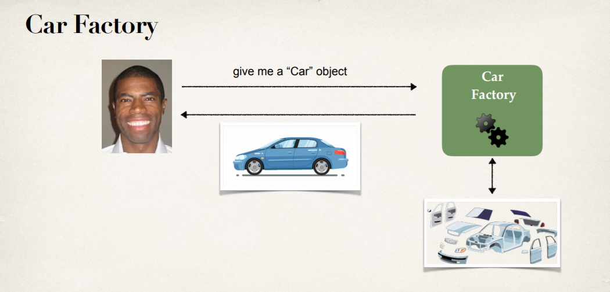
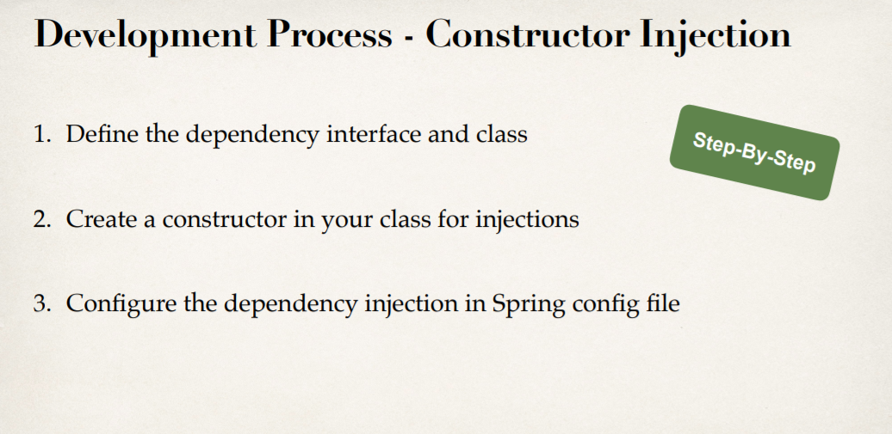
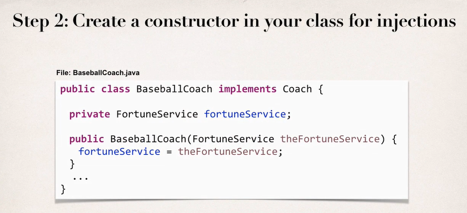
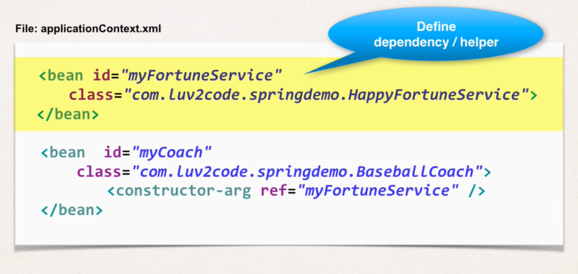

# Dependency Injection





일반적으로 자동차회사에서 자동차를 사면, 자동차의 부품과 같은 의존적인 대상들이 자동차에 설치 되어있는 채로 온다. 사용자가 바퀴나 핸들을 직접 조립하지는 않는다. 

이러한 dependency (helper object) 들을 모두 주입한 완전체 객체를 반환하는 것이 일반적인데, 이 과정에서 Car Factory가 '의존성을 주입 해준 것'이 된 것이다.


주입하는 방식은 일반적으로 Constructor를 통해서, Setter를 통해서 객체를 주입한다. auto-wiring에 대해서는 나중에..


**Constructor Injection**



- Interface와 class를 정의한다.

  

  

- Injection을 위한 Constructor를 class에 정의한다

  

  

- Spring config file에 dependency injection을 설정한다.

  

  먼저 helper class 에 대한 bean을 정의해주고, 밑의 constructor-arg에 해당 bean의 id를 넣어주면 된다.


당연히 constructor로 inject 할 거니까 constructor에 주입하는 내용을 담아야겠지.

Spring은 보이지 않는 곳에서 helper class를 생성한 다음, constructor를 통해 helper class instance를 주입할 것이다.


**Example code**

```java
package springdemo;

public interface Coach {
	public String getDailyWorkout();
	
	public String getDailyFortune();
}
```

getDailyFortune 메소드에 Inject 한 helper class의 메소드를 사용할 계획


```java
package springdemo;

public interface FortuneService {
	public String getFortune();
}
```

```java
package springdemo;

public class HappyFortuneService implements FortuneService {

	@Override
	public String getFortune() {
		return "Today is Your Lucky Day";
	}
}
```

Interface랑 Implementation class를 둘다 정의


```java

public class BaseBallCoach implements Coach{
	
	//define a private field for the dependency
	private FortuneService fortuneService;
	
	//define a constructor for dependency injection
	public BaseBallCoach(FortuneService theFortuneService) {
		fortuneService = theFortuneService;
	}
	
	@Override
	public String getDailyWorkout() {
		return "Spend 30 minutes on batting practice";
	}

	@Override
	public String getDailyFortune() {
		return fortuneService.getFortune();
	}
}
```

baseball coach에 private field를 추가하고, constructor에서 주입한 fortuneService를 field에 할당한다

그리고 getDailyFortune에서 fortuneService의 메소드를 사용한다.


이렇게 해놓고 이제 config 해야겠지.

```java
<bean id="myFortune"
    	class="springdemo.HappyFortuneService"></bean>
<bean id="myCoach"
	class="springdemo.BaseBallCoach">

	<constructor-arg ref="myFortune"/>
</bean>
```

위에는 helper class를, 밑의 constructor에는 helper class의 id를 constructor-arg로 넣는다.


```java
System.out.println(theCoach.getDailyFortune());
```

주입은 자동으로 했을거니 main 코드에 이것만 추가하면 된다.


**Setter Injection**

Setter도 Constructor과 몇개만 다르고 흐름은 비슷하다. 결국 setter 메소드를 규칙에 맞게 설정하고, xml을 변경하면 된다.


```xml
<bean id="myFortuneService"
      class="springdemo.HappyFortuneService" scope="singleton"></bean>

<bean id="myCricketCoach" class="springdemo.CricketCoach" scope="singleton">
    <property name="fortuneService" ref="myFortuneService"/>
</bean>   
```

여기서는 property에 class에 정의해둔 메소드의 property이름에 맞게끔 name을 작성하고, ref는 주입하는 Object의 bean의 id를 넣으면 된다.


**Literal Values Injection**

class의 property로 Literal Value를 주입하는 경우엔 

```xml
<bean ..>
	<property name="emailAddress" value="hello@naver.com" />
</bean>
```

이런식으로 하면 된다.

근데 일반적으로 환경변수는 file 형식으로 보관을 할 것이다.


sport.properties 라는 파일을 만들어 내용물을 이렇게 작성하자

```
foo.email=hello@naver.com
foo.team=naver
```


xml 상단에 이를 작성해주어 xml 내에 사용되는 변수를 지정한다.

```xml
<context:property-placeholder location="classpath:sport.properties"/>
```


그럼 이와 같이 사용할 수 있다.

```xml
<property name="emailAddress" value="${foo.email}"/>
<property name="team" value="${foo.team}"/>
```


잘 된다.

