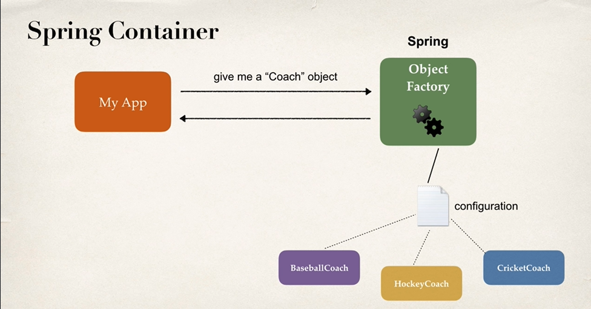
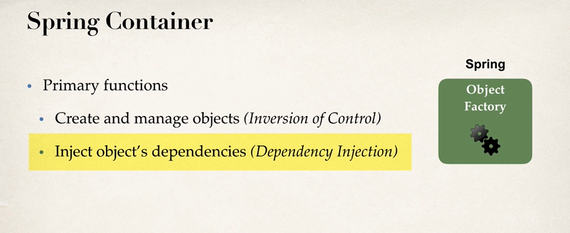
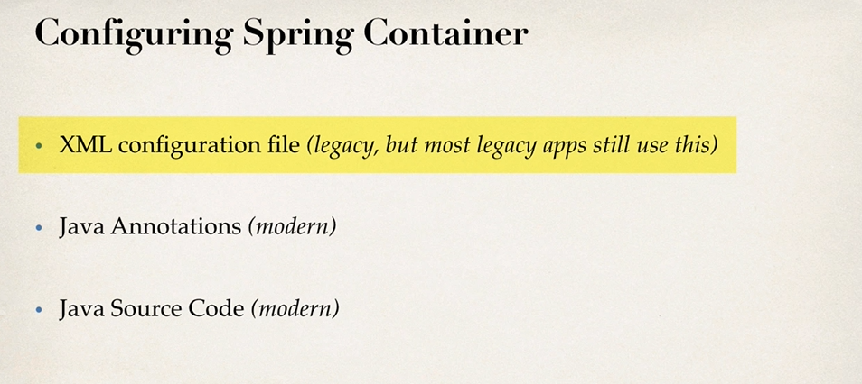
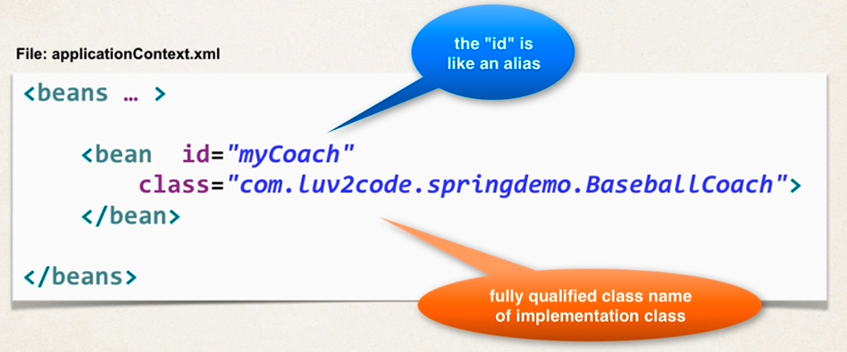
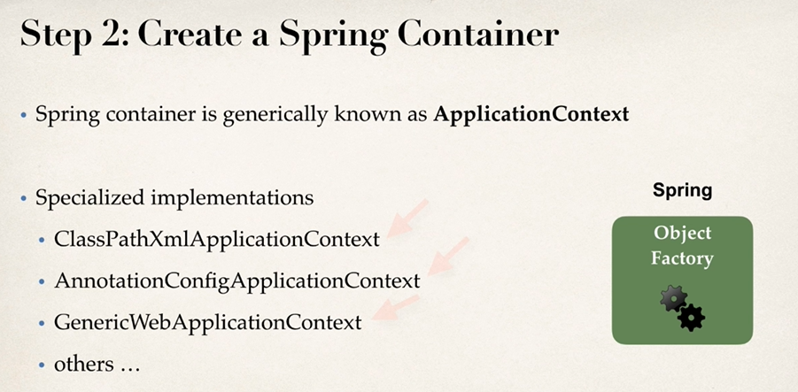
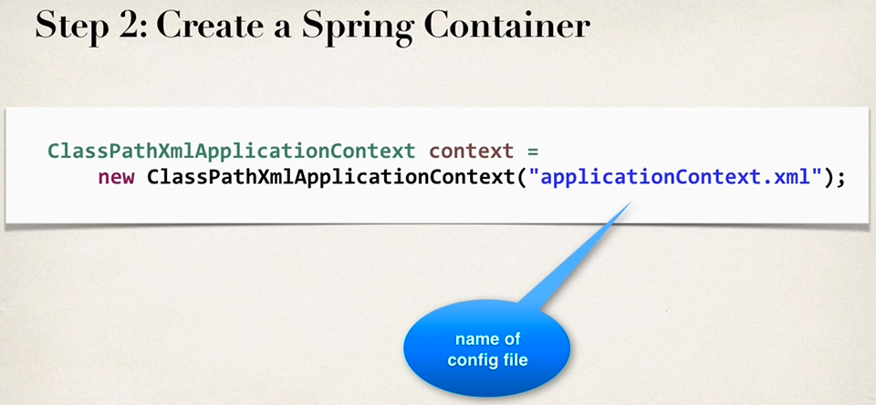
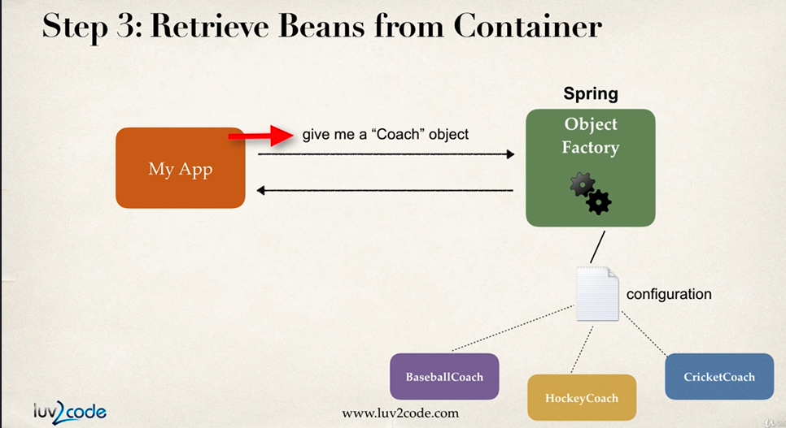
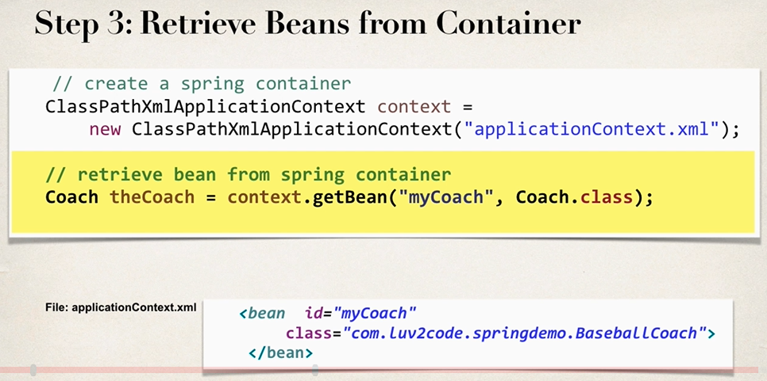
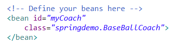

# Inversion Of Control


### Spring Bean

- Spring Container에 의하여 생성된 Java Object를 Bean 이라고 한다.


### Spring Container




Spring에서는 IOC를 지원합니다. App에서 요청하면, 작성된 Configuration을 통해 Object를 생성 후 리턴합니다.




Spring Container는 object를 생성 관리하고, Dependency를 주입해준다.




- XML configuration을 통해서 Configuration 할 수도 있다. 이건 예전 건데 레거시를 다루게 될 수도 있으니까.
- Java Annotation, Java Source Code도 최신 방식이다. 




- 이와 같이 bean에 대한 정보를 작성해주면 된다.




- Spring Container는 ApplicationContext로 알려져 있다.




- config file을 넣어주면 Spring Container가 생성된다.




- 이제 생성된 Container에서 Bean을 요청한다.




- 이런식으로 생성된 container에서 bean을 요청하는 것. 메소드가 있다. 그냥 쓰면 된다.


#### 예시


먼저 xml 파일을 작성하자.

```xml
<?xml version="1.0" encoding="UTF-8"?>
<beans xmlns="http://www.springframework.org/schema/beans"
    xmlns:xsi="http://www.w3.org/2001/XMLSchema-instance" 
    xmlns:context="http://www.springframework.org/schema/context"
    xsi:schemaLocation="http://www.springframework.org/schema/beans
    http://www.springframework.org/schema/beans/spring-beans.xsd
    http://www.springframework.org/schema/context
    http://www.springframework.org/schema/context/spring-context.xsd">

    <!-- Define your beans here -->
    <bean id="myCoach"
    	class="springdemo.BaseBallCoach">
    </bean>
</beans>
```

위의 것들은 기본적으로 필요한 값들이다.

bean을 작성하면, myCoach라는 이름을 가진 Bean이 어떤 Class의 객체인지를 지정할 수 있게 된다.


```java
package springdemo;
import org.springframework.context.support.ClassPathXmlApplicationContext;

public class SpringHelloApp {
	public static void main(String[] args) {
		
		// load the spring configuration file
		ClassPathXmlApplicationContext context = 
				new ClassPathXmlApplicationContext("applicationContext.xml");
		
		// retrieve bean from spring container
		Coach theCoach = context.getBean("myCoach", Coach.class);
		
		// call methods on the bean
		System.out.println(theCoach.getDailyWorkout());
		
		// close the context
		context.close();
	}
}
```

Configuration을 입력함으로써 Container 를 만들고, 해당 Container에서 Bean을 가져왔다. 메소드 출력 확인 후 마무리.


여기서 myCoach에 해당하는 class를 변경하고 싶으면, 소스코드를 변경하지 않고 xml 만 슬쩍 변경하여 사용하는 것이다.




이렇게 하면, 우리의 App은 Configureable하게 된 것이고, Bean에서 서로 다른 class를 부름으로써 쉽게 변경이 가능하다.


#### Why do we specify the Coach interface in getBean()?

*Behaves the same as getBean(String), but provides a measure of type safety by throwing a BeanNotOfRequiredTypeException if the bean is not of the required type. This means that ClassCastException can't be thrown on casting the result correctly, as can happen with getBean(String).*


