# MVC

> Spring MVC에 대해 정리합니다

Spring MVC는 Java의 web application을 만들기 위한 Framework

MVC Design Pattern을 기반하며

Spring Framework의 Core Feature인 IoC와 DI를 적용할 수 있다.

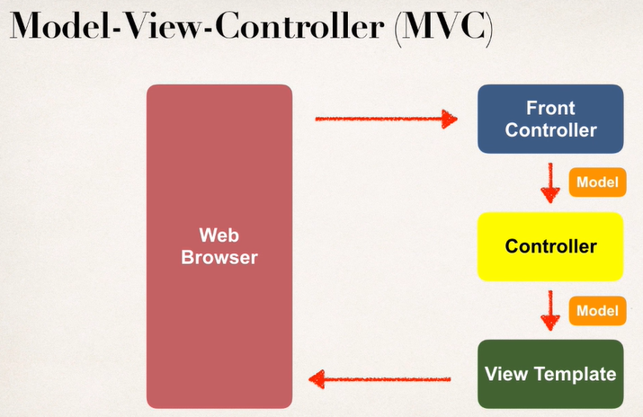

Process Flow (근데 검색해보니 다양한 사진이 나오더라 참고만하자)

- Web 요청은 Front Controller 로 오고, Controller로 Delegate됨
- Controller엔 내가 만든 Business Logic이 있음
- Controller에선 model을 다시 Front Controller로 전달
- Front Controller는 해당 Model을 View Template로 전달
- View Template는 모델 데이터를 뷰에 뿌린 후 프론트 컨트롤러에 넘기고, 결과를 response로 던짐.

사실 설명만 놓고 보면 이 그림이 맞음.

### Spring MVC Benefits

- UI Component 재사용
- web request manage 도움
- Form Data Validation, Conversion에 용이
- view layer configuration이 자유로움

### Behind the Scene

- Spring MVC Components
  - UI Components
  - Spring Beans
  - Spring Configuration

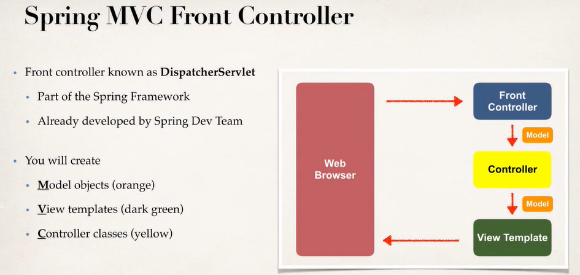

Front Controller는 DispatcherServlet 이며, Spring Framework 의 일부로써 이미 만들어진 것. 내가 만들어야 할 것은 Model, View, Controller 이다.

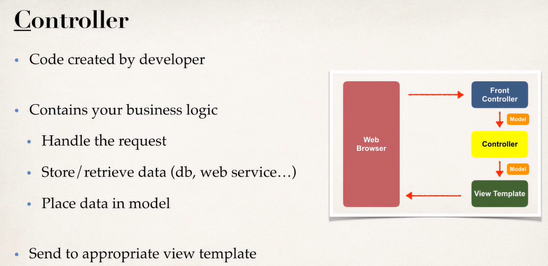

Controller는 우리가 직접 짜야한다. 

- 일반적으로 Business Logic이 있음.
- 요청을 Handle하고, Data를 저장 혹은 DB로부터 가져오던지..
- Data를 Model에 넣는다.

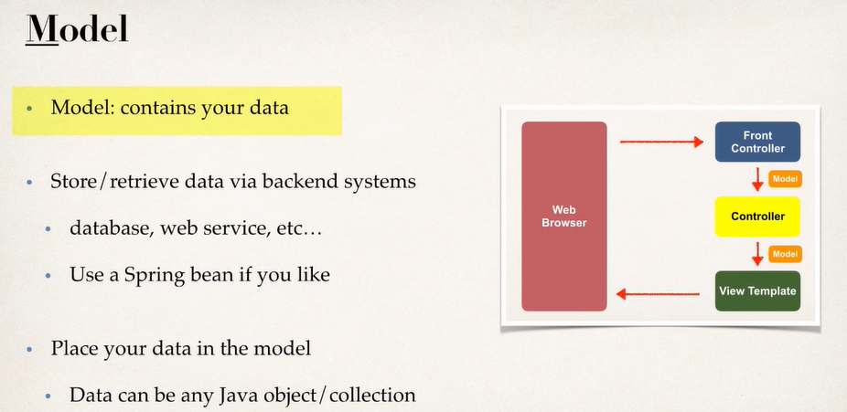

- Model은 데이터를 저장한다.
- DB나 웹서비스로부터 정보들을 가져와서
- 해당 Data들을 Model에 넣는다.

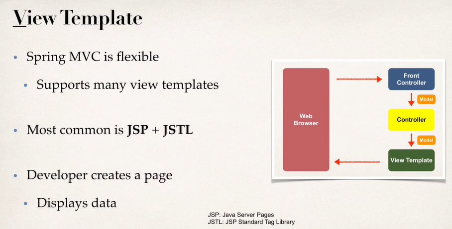

- Spring MVC 는 매우 flexible, 솔직히 JSP JSTL 안쓸거다. 

### Spring MVC Configuration

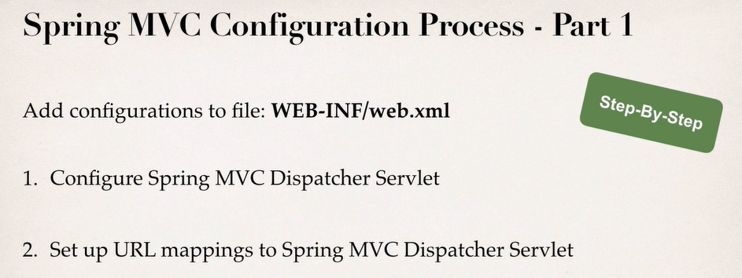

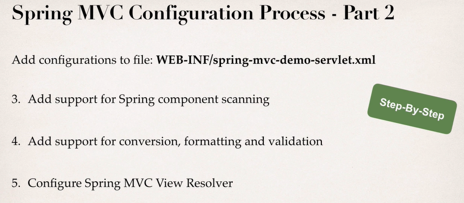

대략 이런 과정을 거치는데, 하나씩 보자.

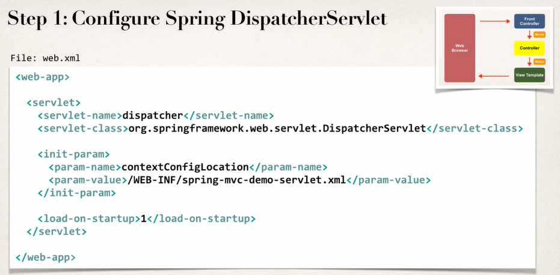

xml에서 Spring DispacherServlet(Front Controller) 에 대한 Entry point를 설정해야 한다.

Servlet 설정 후 Initial Parameter를 설정해야한다. Spring context file의 위치를 작성해주자.

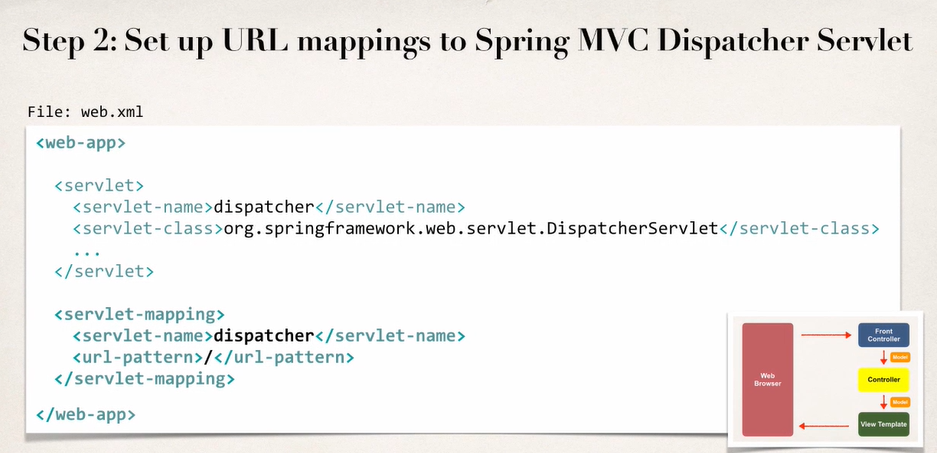

다음엔 URL Pattern에 대해 어떤 dispatcher를 사용할지를 정해준다. /로 들어오는 모든 요청은 해당 dispatcher를 사용한다는 뜻이다.

여기서 servlet-name이 위에 정의한 servlet의 이름과 매칭이 되어야 한다.

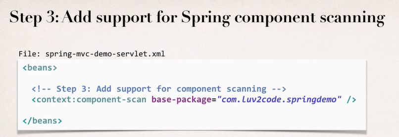

이이전에 수행했던 Component Scan 설정을 해준다.

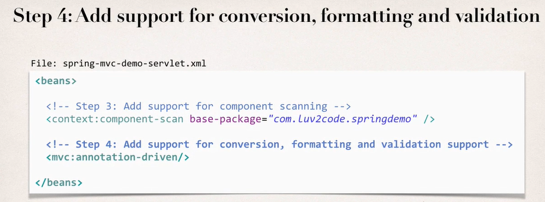

Form data에 대한 Conversion, Formatting, validation을 지원해주는 설정을 추가한다.

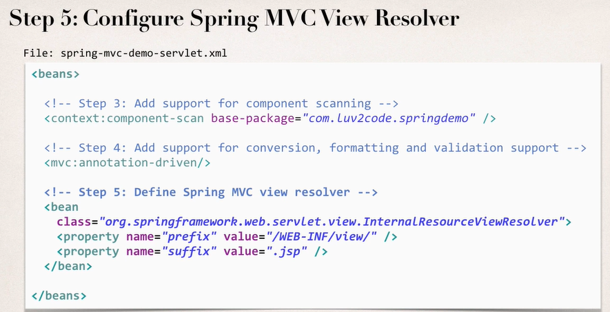

Spring View Resolver를 지정한다. 어떻게 Page를 정하고 위치가 어딘지에 대해서 정한다.

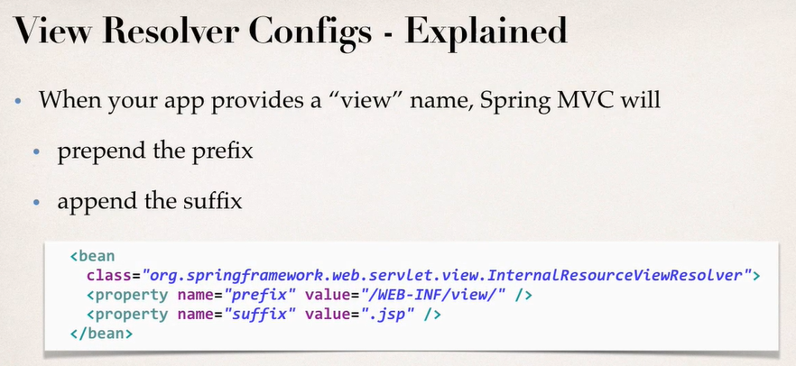

파일을 찾을 때, 우리가 view의 name만 지정하면, 저 property의 prefix와 suffix를 붙여서 완벽한 파일 경로를 만들어서 찾는다는 뜻이다. 

#### 파일 설정

- spring-mvc-demo > WebContent > WEB-INF > lib에 Spring jar 파일을 모두 넣는다.
- xml을 상단 폴더에 넣는다.

### 개발 프로세스

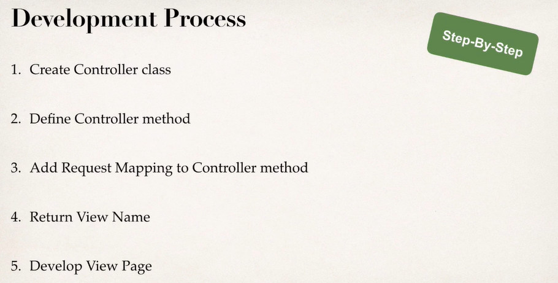

1. Controller Class를 생성한다
2. Controller Method를 정의한다
3. Controller Method에 Request를 Mapping 한다.
4. View Name을 리턴한다
5. View Page를 만든다

### Controller 만들기

- @Controller Annotation을 Class에 추가한다
  - 애는 @Component를 상속하기 때문에 Scanning 시 자동으로 추가됨.
- Controller에 메소드를 추가한다
- 해당 Controller에 Request를 Mapping 한다
  - input으로 Route를 지정한다
  - 모든 Type의 요청이 해당 메소드에 갈 것

- 해당 메소드에서 View Name을 리턴한다

#### 확인사항

- 이상하게 URL Bind가 안된 것 같으면 Component Scan이 잘 되었는지 확인하자.
- 서버 Port가 잘 설정되었는지 확인하자

