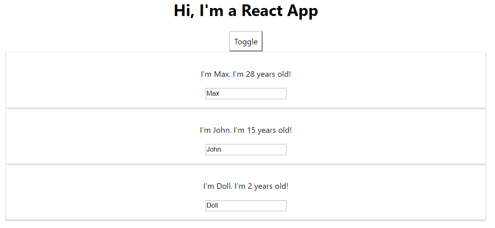

# Rendering List and Conditions


### Render Content Conditionally

```javascript
{ this.state.showPerson ?
    <<jsx>>
    </div>
: null }
```

삼항 연산자를 사용하여 state의 상태에 따라 해당 jsx를 렌더링할지 여부를 결정할 수 있다. 이를 이용하여 toggle을 만들 수 있다.


```javascript
togglePersonsHandler = (event)=>{
    const doesShow = this.state.showPerson;
    this.setState({showPerson:!doesShow}); 
}

<button style={style} onClick={()=>this.togglePersonsHandler()}>Toggle</button>
```


위 방법은 return 내의 조건이기 때문에, 프로젝트의 사이즈가 커질수록 파악하기 힘들어질 것이다. 

render 함수 내에서 조건 식을 개별적으로 작성하여 지정하는 것이 바람직하다.

```javascript
let persons = null;
if(this.state.showPerson){
    persons = (<<jsx>>)

return (...
{persons}
...)
```

이와 같이 구성하면, 변수 명으로 어떤 값이 렌더링 될지 명시해줄 수 있다. 


### Render List of Data

```javascript
personList : [
    { name : "Max", age : 28},
    { name : "John", age : 15},
    { name : "Doll", age : 2},
],
```

이와 같이 Array of Person이 server로부터 json 형태로 왔을 경우, 이 객체를 각각 render 해야 하는 상황이다.


```javascript
persons = (
    <div>
    {[this.state.persons.map(person=>{
     return <Person 
        name={person.name} 
        age={person.age}/>
})}
    </div>
)
```

이와 같이, map을 이용하여 각 element를 jsx로 mapping 시킨 결과를 리턴하게 하면 된다.


### Manipulate List Components

List에 있는 요소를 클릭함으로써 제거해보자. 그렇기 위해선 이전에 만든 Person이란 컴포넌트에 Onclick시 deletePersonHandler가 작동하게 해야 한다.

그렇기 위해 우선 props로 Handler를 전달해준다.

```javascript
{this.state.persons.map((person, idx)=>{
    return <Person 
    click={()=>this.deletePersonHandler(idx)}/>
```

Handler는 input으로 idx를 받는데, 이는 map 함수에서 bind 된다. 받은 idx의 item을 제거하는 Handler를 만들어보자.

```javascript
deletePersonHandler = (personIdx)=>{
    const persons = this.state.persons;
    persons.splice(personIdx, 1);
    this.setState({persons:persons});
  }
```

근데 이렇게 하면 person 변수가 포인터를 가져왔으므로 상태가 Immutable 하지 않으므로, 포인터가 아닌 복사본을 가져오게 하자.

```javascript
const persons = [...this.state.persons];
```


### Key Property

- Array를 JSX Element로 mapping 할 때 Key 라는 prop이 꼭 포함되어야 한다.
- Key property는 react state를 효과적으로 update 해준다.


이전 예시에서, 우린 idx를 Handler에 전달하여 List에 있는 항목을 지우고, 해당 List 전체를 다시 render 했다. 근데, 만약 key Property가 제공된다면, reactDOM은 해당 key의 변화만을 감안해서 다시 render 한다. 이러한 방식이 훨씬 효율적이다.

```javascript
return <Person 
key={idx} />
```

인덱스는 각 객체마다 unique 하기 때문에 사용하기 적절하다. 실제 데이터는 각 array 값들에 대해 id가 있을 것이기 때문에 그걸 매칭해주면 된다.


### Truly Flexible Component

이전까지는 특정 값을 변경하면, 그와 연결된 모든 컴포넌트를 reload 해주었다. 근데, 이젠 key값을 할당해 주었기 때문에 변경된 컴포넌트만 reload 해주게끔 만들 수 있다.

```javascript
nameChangeHandler = (event, id)=>{
    const personIdx = this.state.persons.findIndex((p)=>{
        return p.id === id;
    })

    const person = {...this.state.persons[personIdx]};

    person.name = event.target.value;

    const persons = [...this.state.persons];
    persons[personIdx] = person;

    this.setState(
        {persons : persons})
}
```

이와 같은 Handler를 하나 만들어주고, Person에 prop으로 전달해주고, Person에서 onClick시 작동되게 하자.

```javascript
changed={(event)=>this.nameChangeHandler(event, person.id)}/>

<input type='text' onChange={props.changed} value={props.name}></input>
```


최종 - 




### Practice

