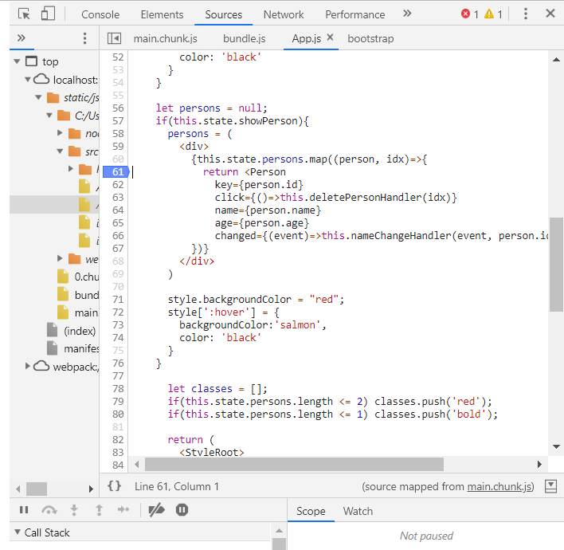

# Debugging React

>  JavaScript는 debug시 debugger 키워드로 웹상에서 디버깅 하면 된다. 그럼 React는 어떻게 하면 될까?


### Chrome Debugger




**F12** 키 혹은 **Ctrl + Shift + J** 를 누르면 크롬 console이 뜨는데, 이를 이용한다.

특정 지점 숫자를 클릭하면, 그 지점에서 멈추고, 한줄 한줄 또는 다음 지점으로 이동하는 식으로 변해가는 값들을 보며 분석하면 된다.


### Using Error Boundary

실제 deploy 된 Page에서 특정 Component가 에러가 발생하여 화면 전체가 깨지는 경우가 발생할 수 있다. 이런 경우를 대비하여 ErrorBoundary를 두어, 에러가 발생한 특정 컴포넌트만 렌더링되지 않게끔 만들어주자.


```javascript
class ErrorBoundary extends Component {
    state = {
        hasError:false,
        errorMessage = '',
    }
    componentDidCatch = (error,info) =>{
        this.setState({hasError:true, errorMessage:error})
    }
    render(){
        if(this.state.hasError){
            return <h1>{this.state.errorMessage}</h1>
        }else{
            return this.props.children;
        }
    }
}
```

이러한 ErrorBoundary Component를 만들어 준 후 Error 발생을 방지해야 하는 컴포넌트에 묶어주자.

```javascript
<ErrorBoundary key={person.id}><jsx><</ErrorBoundary>>
```

Error Handling을 위한 High order Component를 구성한 것이다. 중요한 점은, key를 ErrorBoundary에 두어야 한다는 것이다. Replicate 해야 하는 대상에 ErrorBoundary가 포함되기 때문이다.


componentDidCatch는 error를 잡은 후 Error가 Throw되지 않게끔 해준다.

**ErrorBoundary는 Build 모드에 대해서만 적용된다. Develop 모드에서는 적용되지 않는다.**