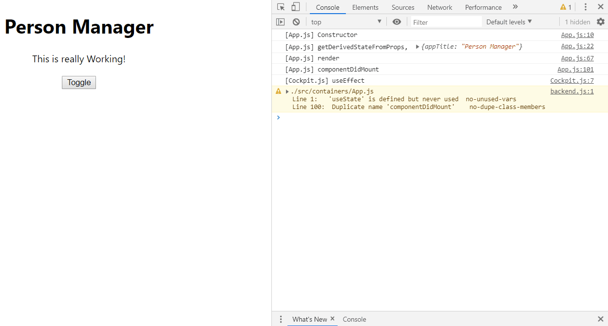

# Component Lifecycle (Unmounting)

> 컴포넌트를 제거 할 때의 Lifecycle 입니다.

### Component Lifecycle

>  Lifecycle이란 컴포넌트가 Mount되고, Update되고, Unmount 되는 일련의 과정을 의미한다.

#### componentWillUnmount

- 해당 컴포넌트가 화면에서 사라지는 경우 (Unmount되는 경우) 작동하는 함수이다.

- 화면에서 사라질 때 (unmount될 때) componentWillMount가 작동하는 것을 알 수 있다.

