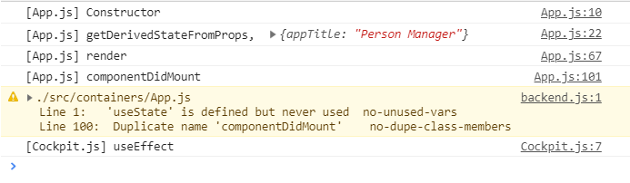

# useEffect

> React Lifecycle이 아닌, 함수형 컴포넌트에 추가할 수 있는 React Hook


```javascript
const Cockpit = (props) => {
    useEffect(()=>{
        console.log('[Cockpit.js] useEffect');
    })
}
```

함수형 컴포넌트에 useEffect에 콜백함수를 넣으면, 모든 render cycle 마다 콜백함수가 실행된다.




useEffect는 class형 Component로 말하면 componentDidMount 되거나 componentDidUpdate되는 시점에 사용된다. 


#### 원하는 시점에 사용하기

```javascript
useEffect(()=>{
    console.log('[Cockpit.js] useEffect');
    setTimeout(()=>{
        alert("Saved data to Cloud");
    }, 1000)
}, [props.persons]);
```

useEffect의 second argument로 target의 목록을 넣을 수 있다. 어떤 값이 변할 때 해당 콜백 함수를 사용하게끔 조건을 두는 것이다.

위 경우는 props.persons가 변경되면 그 때 콜백 함수를 실행하게 하는 것이다.


처음 생성될 때 props.persons가 변경되고, toggle될 땐 props.persons가 변하지 않고, text를 입력할땐 변한다.

props.persons가 변경된 경우에만 alert 가 작동하는 것을 알 수있다.


#### 컴포넌트가 제거될 때 함수 실행하기

```javascript
useEffect(()=>{
    console.log('[Cockpit.js] useEffect');
    setTimeout(()=>{
        alert("Saved data to Cloud");
    }, 1000)
    return ()=>{
        console.log("[Cockpit.js] cleanup work in useEffect");
    }
}, []);

```

- 위 함수엔 2번째 인자로 빈 배열을 입력한다.
- 콜백함수가 처음 등장시 한번 실행되고, return되는 해당 component가 사라질 때 수행된다.


Cockpit이 생성되는 경우에 useEffect 내 함수가 실행되고, 제거되는 경우에만 return 한 콜백함수가 작동하는 것을 알 수 있다.


이런 점들을 보면 useEffect는 매우 확장성이 높은 함수임을 알 수 있다.


#### Component 삭제 시 사용되는 콜백함수의 용례

```javascript
useEffect(()=>{
    console.log('[Cockpit.js] useEffect');
    const timer = setTimeout(()=>{
        alert("Saved data to Cloud");
    }, 1000)
    return ()=>{
        clearTimeout(timer);
        console.log("[Cockpit.js] cleanup work in useEffect");
    }
}, []);

```

- 생성시 작동하는 setTimeout을 리턴되는 함수에서 clearTimeout을 설정함으로써, 작동을 중단시킬 수 있다.


**참고할 점**

- **useEffect를 initialize 되는 처음 한번만 사용하고 싶으면 empty array를 넣으면 된다.**
- **useEffect 는 하나의 함수형 컴포넌트 내에 중복하여 여러번 사용할 수 있다**


