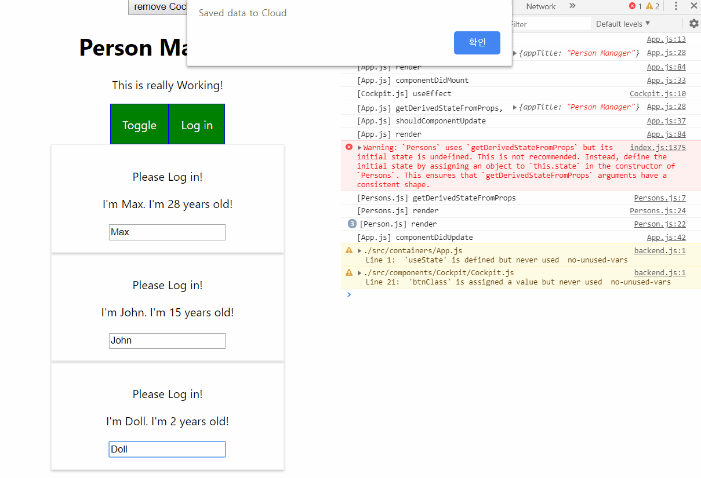

# ETC


### Setting State Correctly

- setState가 즉시 실행된다고 보장 할 수 없어서 race condition에 놓일 수 있다.
- 이전 state를 보장하려면 setState에 콜백함수를 리턴해야 한다.

```javascript
this.setState(
    (prevState, props)=>{
        return {
            persons : persons,
            changeCoutner : prevState.changeCoutner + 1,
        }
    }
)
```

setState에 콜백의 인자로 prevState와 props를 제공하여, 이전 state를 레퍼런스하여 값을 변경할 수 있어 정확하다.


### PropTypes

`npm install -save prop-types` 로 prop-types 라는 패키지를 설치한다. 이는 리액트가 제공하는 일종의 타입 명시 시스템이다.


```javascript
import PropTypes from 'prop-types';

Person.propTypes = {
    click : PropTypes.func,
    name : PropTypes.string,
    age : PropTypes.number,
    changed : PropTypes.func
}
```

각 컴포넌트에 대해 해당 컴포넌트의 propTypes 프로퍼티를 위와 같은 객체로 지정해 주는 방식으로, 입력되는 props들에 대한 타입을 명시해 줄 수 있다.


만일 이를 어길 시 밑과 같은 warning이 발생한다.


age라는 prop이 number가 들어오길 기대했는데 string이 들어왔다고 오류 사항을 자세히 명시해준다. (매우 편함)


### Using Refs


Persons의 마지막 input을 자동적으로 focus 하게 하는 방법이 있을까? 커서가 자동으로 거길 가르키고 있게끔 하는 방법이 있을까?

단순히 Constructor 에서 document.querySelector('input').focus() 로 설정하는 방법은, HTML에서 매칭되는 맨 위의 대상이 먼저 리턴되기 때문에 부적합하다. 이는 React가 아닌 General DOM Selector기 때문이다.

React엔 Ref를 이용하여 Element를 설정하고 선택할 수 있다.


```javascript
<input type='text' ref={(inputEl)=>{this.inputEl = inputEl}} onChange={this.props.changed} value={this.props.name}></input>
```

input의 prop으로 ref를 설정하고, 이 안에 콜백함수를 두었다.  콜백의 첫번째 인자로 해당 Element가 input으로 들어간다.

```javascript
componentDidMount(){
    this.inputEl.focus();
}
```

그 후 Element 가 모두 Mount 되었을 때 최종적으로 this.inputEl로 설정한 마지막 input 이 Element로 들어가게 된다.


**위 방법은 componentDidMount 라는 라이프사이클을 이용하기 때문에 오직 Class Based Component에서만 가능하다**


### Using Refs 2 >> 최신 문법 (16.3)


```javascript
constructor(props){
    super(props)
    this.inputElementRef = React.createRef();
}
```

컴포넌트를 생성하는 시점에서 Reference를 React.createRef() 함수로 생성해준다. **꼭 Class Based Component는 constructor에서 올바른 상속을 위해 super를 해주자.**


```javascript
ref={this.inputElementRef}
```

를 prop에 추가해주면, Constructor에 생성했던 레퍼런스의 current property가 해당 Element를 가르키게 해준다.

```javascript
componentDidMount(){
    this.inputElementRef.current.focus();
}
```

이후 해당 레퍼런스의 current에 focus() 처리 해주면 된다.


### Refs with React Hook

함수형 컴포넌트를 위한 useRef Hook을 사용하면 Ref를 지정할 수 있다.


```javascript
import React, { useEffect, useRef } from "react";
const toggleBtnRef = useRef();
```


이후, 해당 컴포넌트가 렌더링 완료된 후에 작업이 이루어 져야 하므로 useEffect 훅을 이용해야 한다. 렌더링 한 첫 시점에 대해서만 작업이 이루어지면 되므로, 2번째 인자로 공백을 넣은 훅에서 실행시켜주자.

```javascript
useEffect(()=>{
    toggleBtnRef.current.click();
}, []);
```

이렇게 설정하면, 처음부터 clicked 된 상태로 렌더링된다.


### Prop Chain Problems

독립된 Person 컴포넌트에 Authenticated 정보를 전달하기 위해, App에서 Authenticated라는 state를 만들고 authenticacted 되었는지 정보를 가장 밑의 컴포넌트에 전달해야 한다. 이때 불필요하게 코드가 복잡해지고, prop을 통해 가장 높은 위치에서 낮은 위치까지 값을 전달해주는 것은 매우 비효율적이다.


#### Context

context라는 폴더를 따로 구분하여, auth-context 객체를 만들어준다.

```javascript
import React from 'React';
// 빈 오브젝트로 초기화
const authContext = React.createContext({});
export default authContext;
```

이 또한 컴포넌트지만, 단순히 해당 context를 사용할 영역을 지정해 주는 역할을 한다.


**Context 설정**

```javascript
<AuthContext.Provider 
            value={{authenticated: this.state.authenticated, login: this.loginHandler}}>

</AuthContext.Provider>
```

AuthContext.Provider는 해당 context를 사용할 수 있는 컴포넌트의 범위를 정해주며, 초기값을 설정해준다.

해당 Component으로 감싸져 있는 대상들에 한해 위 context를 사용할 수 있다.


**Context 사용**

```javascript
<AuthContext.Consumer>
            {(context) => {console.log(context.authenticated); return context.authenticated ? <p>Authenticated</p> : <p>Please Log in!</p>} }
        </AuthContext.Consumer>
```

context를 사용하는 시점은, 해당 context를 사용하는 지점에만 Consumer로 감싼 후, 안에 js 문법을 실행하기 위해 {}로 감싸고, 함수의 인자로 context를 넣어준다. 

이때 미리 설정한 context의 값들은  context의 property로 들어가 있기 때문에, 위와 같이 사용해 주면 된다.


**jsx 밖에서 Context 사용하기 >> REACT 16.6**

```
static contextType = AuthContext;
```

예를 들어, componentDidMount에서 해당 context를 사용하여 HTTP Request를 날릴지 말지를 설정하게 된다면, 위 코드를 추가해주자.

import한 context를 static 변수 contextType로 설정해주면, 이제 this.context의 형태로 사용할 수 있다.

```javascript
{this.context.authenticated ? <p>Authenticated</p> : <p>Please Log in!</p>}
```

이전과 달리 쓸데없는 태그가 하나 줄어 코드가 매우 깔끔해졌다.


**function based Component에서 context 사용하기**


```javascript
const context = useContext(AuthContext);
```

함수형 컴포넌트에도 연결해주는 기능이 있다. useContext 훅을 사용하여 context를 해당 컴포넌트에 지정하여 어느 위치에서든 사용할 수 있다.

```javascript
<button onClick={context.login}>Log in</button>
```

역시 코드가 매우 간결해졌다!


### 정리




### 좀더 공부하자

- https://reactjs.org/docs/hooks-effect.html

- https://reactjs.org/docs/state-and-lifecycle.html
- https://reactjs.org/docs/typechecking-with-proptypes.html
- https://reactjs.org/docs/higher-order-components.html
- https://reactjs.org/docs/refs-and-the-dom.html