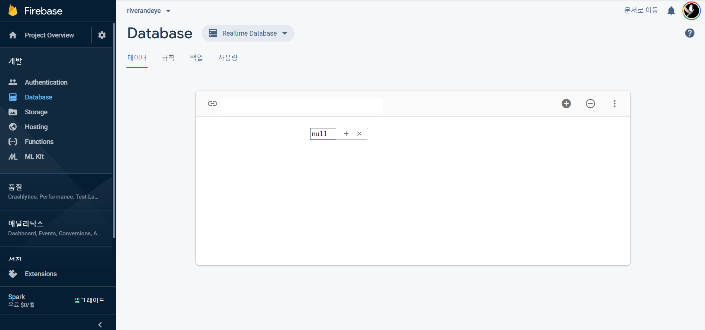
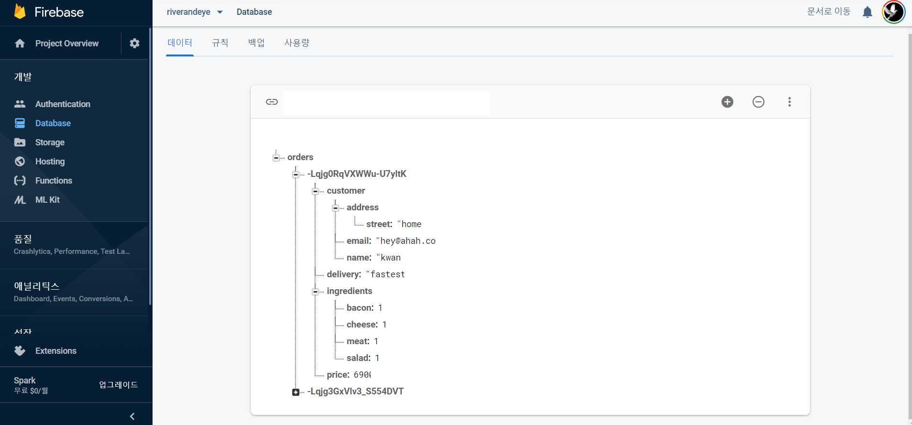
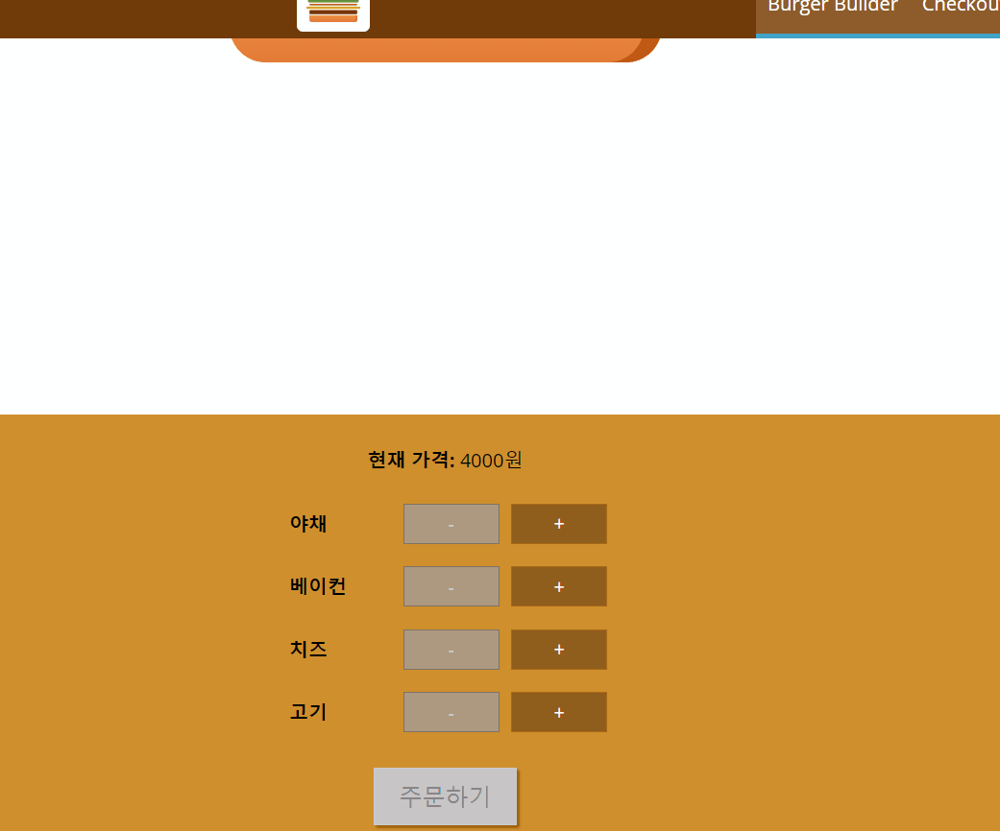
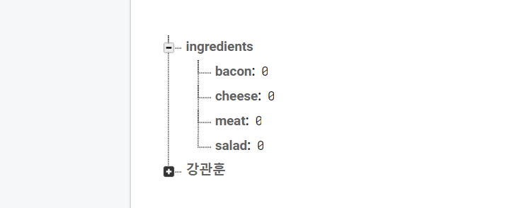

# Burger_Builder_Server


#### Firebase 설정

- firebase 프로젝트 생성 -> realtime database 생성 
- 규칙에 rules.read, rules.write true로 변경 >> auth 설정하지 않았기 때문에 해줘야함.

```json
{
  "rules": {
    ".read": true,
    ".write": true
  }
}
```




대략 이런 화면이 뜨고, 해당 database에 접근할 수 있는 url이 보일 것이다 (지금은 가려놓음).

위 url을 mainUrl로 설정하고, 해당 url 뒤에 더 붙여서 저장할 위치를 설정한 후에 json 형태로 보내면 된다. (자세한 것은 Firebase 설명에..)


#### axios를 이용해 json 날리기

axios를 import 하여 baseURL 설정하여 export 해준다.

```javascript
import axios from 'axios';

const instance = axios.create({
  baseURL: `https://너의주소.firebaseio.com/`
});

export default instance;
```


이전에 주문하기 버튼을 누르면 alert 창이 떴는데, 이젠 axios를 이용하여 서버로 요청을 보내보자.

```javascript
import axios from '../../axios-orders';
purchaseContinueHandler = () => {
    const order = {
        ingredients: this.state.ingredients,
        price: this.state.totalPrice,
        customer: {
            name: 'kwan',
            address: {
                street: 'home'
            },
            email: 'hey@ahah.com'
        },
        delivery: 'fastest'
    };
    axios
        .post('/orders.json', order)
        .then(response => console.log(response))
        .catch(error => console.log(error)); // .json
};
```

axios의 post 메소드를 이용하여 baseurl의 orders.json의 위치에 해당 json 정보를 날려준다.

그럼 firebase에 다음과 같이 업데이트된 데이터베이스를 확인할 수 있다.





#### 비동기 작업 하는 동안 Spinner 보여주기

구매 버튼을 누르는 동안 서버와 통신해서 주문을 날려야 한다. 

주문을 날리는 비동기 코드에서 then 이후의 코드가 동작하기 전까지 앱은 본인이 **통신 상태** 에 있다는 것을 알아야 한다.  고로 state에 loading이라는 변수를 추가하여 해당 state면 spinner가 돌아가게끔 한다.

[스피너 CSS 링크](https://projects.lukehaas.me/css-loaders/)

```javascript
purchaseContinueHandler = () => {
    this.setState({ loading: true });
    
    ...
    
axios
    .post('/강관훈.json', order)
    .then(this.setState({ loading: false, purchasing: false }))
    .catch(error => this.setState({ loading: false, purchasing: false })); // .json
```

purcharseContinueHandler (확인 버튼을 누르면 작동하는 핸들러) 를 누르면 loading state를 true로 변경시킨다. 그 후 비동기 코드가 작동되고, 비동기 코드의 작동이 끝나면 실행되는 then 메소드에서 loading state를 false로 변경한다.

```javascript 
let orderSummary = (
    <OrderSummary
    ...
/>
    );
if (this.state.loading) {
    orderSummary = <Spinner />;
}
```

기존에 orderSummary 였던 부분을, loading일 시 Spinner가 등장하게끔 밑의 조건문을 추가해서 orerSummary 변수를 변경한다. setState 실행시 update가 이루어지면서 render되므로 자연스럽게 render() 함수가 실행될 것이고, 해당 조건문이 작동해 기존 OrderSummary 컴포넌트 대신 위 코드가 작동될 것이다.




##### then, catch 구문에 주석을 달면 이와 같이 오래 보인다. (워낙 통신이 빨라서 로딩이 잘 안보임)


#### Handling Errors - global scope

컴포넌트를 통채로 에러 핸들링 하는 좋은 방법은, hoc를 만들어 hoc에서 에러를 처리하게 하는 것이다.

```javascript
const withErrorHandler = (WrappedComponent, axios) => {
  return class extends Component {
    render() {
      return (
        <Aux>
          <Modal>
          	대충 에러라는 뜻
          </Modal>
          <WrappedComponent {...this.props} />
        </Aux>
      );
    }
  };
};
export default withErrorHandler;
```


HOC를 만든다면 대충 이런 식일 것이다. 묶어서 실행했을떼 에러라면 에러가 떴다는 모달이 나와야된다. 그럼 당연히 이 컴포넌트가 에러가 있다는 걸 알아야겠지. 그럼 자연스럽게 state를 추가해줘야 한다.

```javascript
state = {
    error: null
};
```


네트워크 통신에서 에러가 생겼다는 걸 어떻게 알까? 컴포넌트는 절대 알수가 없다. axios를 이용하여 통신을 하고 있으므로, 해당 axios의 response에 에러가 있는지 없는지 확인해야 한다. 그러므로 우선 외부에서 선언한 axios를 입력받아야 한다.

```javascript
const withErrorHandler = (WrappedComponent, axios) => {
```


컴포넌트가 Mount 되었을 때 axios의 interceptor를 이용하여 메세지를 보낼시 에러를 초기화해주고,  response에 에러가 있을 시 에러 처리를 해주어야 한다.

```javascript
componentDidMount() {
    axios.interceptors.request.use(req => {
        this.setState({ error: null });
        return req;
    });
    axios.interceptors.response.use(
        res => res,
        error => {
            this.setState({ error: error });
        }
    );
}
```


모달의 바깥창이 눌릴 때 모달이 없어져야 하므로, props.show를 현재 error로 전달해주어야 한다. 또, errorConfirmHandler를 이용하여 해당 class의 error를 변경해주어야 한다.

```javascript
errorConfirmedHandler = () => {
    this.setState({ error: null });
};

<Modal
show={this.state.error}
modalClosed={this.errorConfirmedHandler}
>
    {this.state.error ? this.state.error.message : null}
</Modal>
```

이렇게 깔끔한 모달형 에러처리 HOC가 완성되었다.


#### Retrieve Data from Backend



firebase에 이런식으로 json 데이터를 만들어주고 이걸 가져와 써보자.


```javascript
componentDidMount() {
    axios.get('/ingredients.json').then(response => {
        this.setState({ ingredients: response.data });
    });
}
```

처음에 ingredients가 없을 때에 대한 에러처리만 하면 된다. 사실 단순하다.

