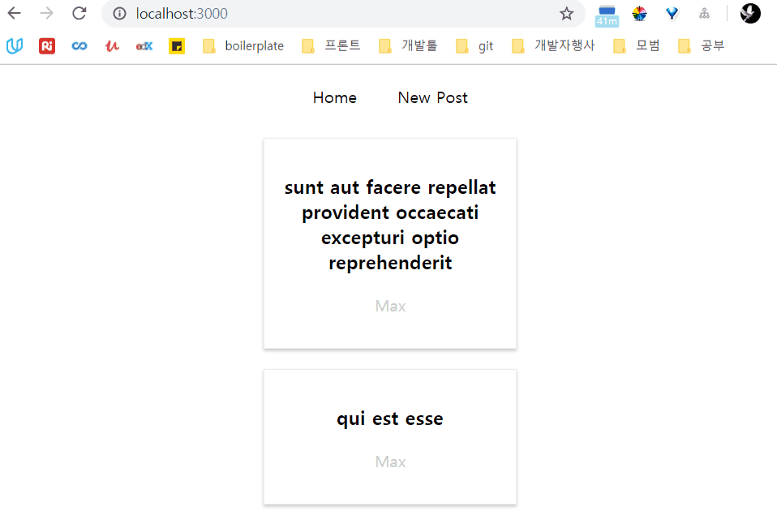
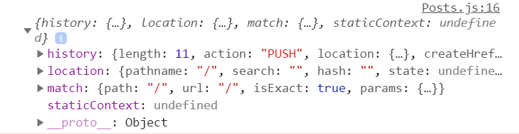
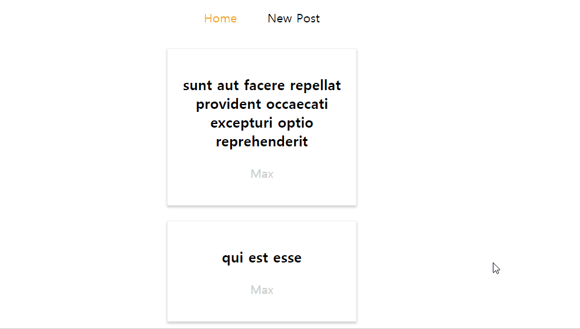

# 11_Routing


### Multiple Pages in a SPA


- 다른 Path에 대해 다른 Page를 리턴하게 하는 것이 목적이다.
- 마치 여러 페이지를 렌더하는 것 과 같은 경험을 주게 한다.

- 그럼에도 불구 여전히 Single HTML을 리턴한다.


**Router Package**의 역할

- URL /Path를 Parse한다.
- Config를 읽어 어떤 Path가 접근 가능한지 판단한다.
- JSX Component를 리턴한다.

결국 서로 다른 Path에 대해 서로 다른 JSX를 리턴한다는 것이다.


### 처음 상태

- Route 세팅을 하지 않으면 다른 route를 설정해도 항상 처음 문서로 이동한다.


### 라우팅을 위한 세팅

- 설치

`npm install --save react-router`


### Routes 나누어보기

```javascript
<section>
    <FullPost id={this.state.selectedPostId} />
</section>
<section>
    <NewPost />
</section>
```

처음엔 이 상태로 있었는데, URL을 분리하여 FullPost만, NewPost만 볼 수 있게 구성해보자.


index.js나 App.js에 react-router-dom의 BrowserRouter를 import 한 후 내가 Routing 하고 싶은 영역에 대해 BrowserRouter를 감싸준다. 현재는 Blog 전체에 대해 걸어주고 싶으므로 App.js에서 감싸준다.

```javascript
import { BrowserRouter } from 'react-router-dom';
import Blog from './containers/Blog/Blog';
class App extends Component {
  render() {
    return (
      <BrowserRouter>
        <div className="App">
          <Blog />
        </div>
      </BrowserRouter>
    );
  }
}
```


그리고 이젠 Routing을 하기 때문에 FullPost와 NewPost가 메인 페이지의 Component가 아닌 하나의 페이지로 분리가 될 것이다. 그러므로 컨테이너로 옮겨주자.


블로그 컴포넌트 내에서 react-router-dom의 Route를 임포트하고 사용하면 된다.

```javascript
import { Route } from 'react-router-dom';
...
<Route path="/" exact component={Posts} />
<Route path="/new-post" component={NewPost} />
```

Path에 따라 등장하는 Component를 다르게 하면, 해당 일치하는 Route에 대해서만 컴포넌트가 등장하게 된다.





문제는 URL이 변할 때 새로고침이 된다는 것인데, 새로고침되면 JS가 새로 시작하게 되고 State가 저장되지 않는다. 그 이유는 a tag를 이용하여 url을 변경하였기 때문이다. react-router-dom의 Link 컴포넌트를 사용해야 한다.

```javascript
<Link to="/">Home</Link>
<Link
to={{
    pathname: '/new-post',
    hash: '#submit',
    search: '?quick-submit=true'
   }}>
```

이를 이용하면 페이지의 일부분만 Reload하게 되어 State를 잃지 않는다.


#### Routing Component의 Props

라우팅 된 컴포넌트에 대하여 ComponentDidMount에 this.props를 찍어보면 못보던 것들이 등장한다.



리액트가 라우팅으로 렌더한 컴포넌트에 위와 같은 기본 정보들을 props로 넘겨준다. 

history - 브라우징한 페이지에 대한 정보

match - 입력한 url에 대한 match 여부 및 params 정보를 리턴

location의 search param을 파싱해서 검색에 사용하거나, hash를 이용하여 특정 페이지의 원하는 위치로 자동 스크롤 할 수 있게끔 한다.


라우팅된 컴포넌트는 이게 있는데, 해당 컴포넌트의 하위 컴포넌트는 이를 전달받지 못한다. 그런데 하위 컴포넌트가 그 라우팅 정보가 필요할 수도 있다. 그렇다고 일일이 그 값을 전달하기엔 조금 번거롭다. 그런 경우에 **withRouter** 컴포넌트를 사용해보자.


```javascript
import { withRouter } from 'react-router-dom';
...
export default withRouter(post);
```

이를 이용하면 상위 컴포넌트가 Route된 경우 하위 컴포넌트도 해당 Route props를 가질 수 있다.


#### Relative Path

```javascript
to={{
    pathname: '/new-post', // absolute path
}}
to={{
	pathname: this.props.match.url + '/new-post' // relative path
}}
```

pathname은 사실 그 자체가 absolute path이다. 리액트에서 relative path 처럼 사용하고 싶으면, 현재 url에 다음 url을 추가하는 방식으로 구성해야 한다. 고로 밑과 같이 this.props.match.url 을 더해주어 사용하면 된다.


#### Active Link 사용하기

어떤 Link가 Active 되어 있는지 active class를 넣어주는 handler를 **따로 구현할 필요 없다.** NavLink 컴포넌트를 이용하면 가능하다. 그냥 기존에 Link로 구현했던 걸 NavLink로 변경해주면 된다.

```javascript
import { Route, NavLink } from 'react-router-dom';
<NavLink to="/" exact>
    Home
</NavLink>
```





해당 링크가 URL에 매치되는 경우, 해당 DOM Element에 active class가 자동으로 추가된다. 이를 이용하면 훨씬 편하다. **active** 라는 클래스 이름 외에 다른 이름을 사용하고 싶으면, 해당 Link의 Prop으로 **activeClassName**을 새롭게 정의하여 전달해주면 된다.

```javascript
<NavLink to="/" exact activeClassName="custom-active">
```


active일 때만 적용되는 inline styling도 지원한다.

```javascript
<NavLink to="/" exact activeStyle={{
	color : ~~,
	textDecoration : underline,
}}>
```


#### Route Parameter 지정하기

이제 어떤 post를 누르면 해당 post에 대한 FullPost를 확인하게 하고 싶다.

```javascript
<Route path="/new-post" component={NewPost} />
<Route path="/:id" exact component={FullPost} />
```

Route를 id로 설정해주자. new-post에 대한 라우터가 먼저 설정되어야, id로 걸러지지 않을 것이다.

해당 Post를 누르면 Path로 이동하게끔 만들기 위해 Component를 통채로 link로 감싼 후 to를 설정해주자.

```javascript
<Link to={'/' + post.id} key={post.id}>
    ...
</Link>
```

위에서 링크를 저렇게 설정해놓고, 밖에서 route를 /:id 로 설정했기 때문에 해당 컴포넌트를 누르면 id에 해당하는 FullPost가 등장하게 되는 것이다. 


#### Query Params 사용하기

```javascript
?something=somevalue
```

url 뒤편의 ? 뒤의 key value pair 들 또한 props.location.search 로 들어온다. 이 key value pair를 javascript object로 변환해 주는 URLSearchParams 함수가 있다.

```javascript
componentDidMount() {
    const query = new URLSearchParams(this.props.location.search);
    for (let param of query.entries()) {
        console.log(param); // yields ['start', '5']
    }
}
```

.entries() 로 해당 결과를 Object 형식으로 받아올 수 있다.

hash는 props.location.hash 로 가져오면 된다.


#### 특정 라우터만 사용하게 하기

```javascript
<Route path="/" exact component={Posts} />
<Route path="/new-post" component={NewPost} />
<Route path="/:id" exact component={FullPost} />
```

그냥 이렇게 두면, 문제가 생긴다. /new-post로 접근시 2번째가 우선 입력이 되겠지만, 그렇다고 거기서 끝나지 않고 밑에 있는 Router도 작동한다. this.props.match.params.id 로 new-post가 들어가게 되는 거고, 당연히 그런 id는 없으니 밑에 Loading... 으로만 뜨고 계속 기다리는 꼴이 될 것이다.


**Switch** 컴포넌트를 이용하여 하위 컴포넌트 라우터 중 하나만 작동하게 만들면 문제는 쉽게 해결된다.

```javascript
<Switch>
    <Route path="/" exact component={Posts} />
    <Route path="/new-post" component={NewPost} />
    Route path="/:id" exact component={FullPost} />
</Switch>
```

Switch 안에 있는 것들만 한번 수행되기 때문에, 밖에 있는 것들은 꼭 한번씩 거치게 되어 분기를 편하게 할 수 있다.


#### Navigating with history

```javascript
postSelectedHandler = id => {
    this.props.history.push('/' + id);
};
```

window.history 처럼 리액트도 Route 되는 Component의 props에 history가 있다. 해당 props에 push 하면 입력된 url에 해당하는 Routes 들의 Component가 render 된다.


#### Nested Routes

```javascript
// Blog.js
<Route path="/" component={Posts} />
// Posts.js
<Route path="/:id" exact component={FullPost} />
```

사실 단순한 이치다. Route에 맞는 것만 드러난다고 했으니, 

localhost/ 로 들어가면 그냥 Post목록이 나올 것이고

localhost/1 로 들어가면 1번 Post에 대한 목록이 나올 것이다.


문제는, 상위 컴포넌트를 다시 업데이트하긴 했지만 하위 컴포넌트의 prop이나 state가 변한게 없어 rerender 하지 않는다는 것이다. 그래서 componentDidUpdate에서도 componentDidMount 에서 수행한 작업을 해주어야 한다. **이때 예외처리를 잘 해주어야 무한으로 반복해서 Update 하지 않는다.**


#### Redirect

```javascript
// Blog.js
<Route path="/post" component={Posts} />
// Posts.js
<Route path="/:id" exact component={FullPost} />
```

url이 위와같이 구성되 있다면, post 목록을 보기 위해 /post로 들어가 주어야 한다. /에서도 Posts를 보여주기 위해서 Route를 복사하여 새로 구성하는 것 보단, **Redirect** 컴포넌트를 사용하는 것이 더욱 바람직하다.

```javascript
<Route from='/' to='/posts' /> // 완전 깔끔
```


#### Conditional Redirect

NewPost를 생성한 경우 버튼을 누르면 Redirect 해서 원래 페이지로 돌아가고 싶다. 이는 버튼을 누를 때만 Redirect를 해야한다. 그럼 단순히 특정 조건을 만족시킬때만 Redirect 컴포넌트를 추가해주면 된다.

```javascript
let redirect = this.state.submitted ? <Redirect to="/posts" /> : null;
```

근데 사실은 이게 그렇게 좋은 방식은 아니고, 어떤게 끝났으면 history에 추가하는 방식으로 push 해주는 것이 더 낫다. 실제로 Form을 입력하고 뒤로가기를 눌렀을 때 다시 Form이 나오게 하는 건 이상적인 방식은 아니다. **replace** 를 써주면, 뒤로가기를 누르면 해당 Form이 나오지 않고, 해당 Form에 들어가기 전의 페이지가 등장한다.

```javascript
this.props.history.replace('/post');
```

