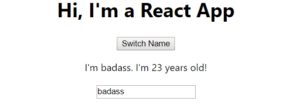

# Base Features & Syntax


### react-app 폴더 분석

- public
  - favicon.ico - 그냥 [favicon](https://blogoon.tistory.com/69) 이다 
  - index.html - default로 Template이 되는 파일 (manifest.json 으로 해당 여부는 지정할 수 있음)
    - meta 혹은 script는 여기 추가해야 한다.
  - manifest.json  - 구성하려는 페이지의 metadata
  - src - 실제 React Application 을 담는 파일
    - index.js : index.html의 dom 객체에 ReactDom을 render 하는 역할을 한다.
    - App.js : 그냥 처음 구현되어있는 App임. index.js에 수렴시켜 merge 하면 됨.
    - App.css : 그냥 처음 구현되어있는 App의 css
    - App.tets.js : Jasmine 으로 작성된 test code


### React Component

- UI의 각 부분을 재사용하기 쉽게 조각해놓은 것이다. 

```javascript
import React, {Component} from 'react';
import './App.css';

class App extends Component {
  render(){
      return (
      <div className="App">
        <h1>Hi, I'm a React App</h1>
      </div>
    );
  }
}

export default App;
```

- 'react' 에서 Component를 가져온 후, App을 상속시켜 render() 라는 메소드를 정의한다. App을 render할 때 해당 메소드가 작동한다.
- 중간에 return 후 plain HTML이 quotation mark 없이 등장하는데, 이는 React여서 가능한 것이다.

```javascript
return (
      <div className="App">
        <h1>Hi, I'm a React App</h1>
      </div>
);

return React.createElement('div', {className:"App"}, React.createElement('h1', null, "Hi! I'm a React App"));
```

위 두 return 은 같은 결과를 리턴한다. 밑의 방식보단 위의 방식이 훨씬 편해 보인다. HTML 값을 전달하는 것 처럼 보이지만, 실제로는 자바스크립트에서 동작하는 것으로 이를 JSX 라고 부른다.


## JSX

- React element 를 생성하는 코드
- Real HTML Tag를 쓰는 것이 아니라, JSX가 지원하는 태그를 사용해야 한다.
  - className : css class 를 지정해줌
- 사용시 주의할 점
  - 사용하는 스크립트 상단에 React 라이브러리를 꼭 불러와야 사용할 수 있음.
  - 최상위 태그는 1개여야 함.
  - 태그안에 들어가지 않는 경우만 태그를 바로 닫을 수 있음.
- Fragment 태그 : 최상위 태그가 1개여야 한다는 조건에 의해 감싸주는 역할을 하는 태그


### Functional Component

그냥 함수형으로 JSX를 리턴하는 함수를 의미한다.

```javascript
import React from 'react';

const person = ()=>{
    return <p>I'm a Person!</p>
} // for this binding

export default person;
```

이를 index.js에 import 하여 그대로 붙였더니 화면에 렌더링이 된다.

```javascript
function tick() {
    const element = (
    <div>
      <h3>현재 시각은 [{new Date().toLocaleTimeString()}] 입니다.</h3>
      <Person/>
    </div>
    );
    ReactDOM.render(element, document.getElementById('root'));
  }
  setInterval(tick, 1000);
```

이와 같이, 컴포넌트들은 쉽게 중복하여 사용될 수 있어 매우 편하다.


### Dynamic Components

같은 Component 라도 Dynamic 하게끔 변경하고 싶다면, JSX 내에 JS 함수를 사용하면 된다.

```javascript
import React from 'react';

const person = ()=>{
    return <p>I am a Person. I am {Math.floor(Math.random() * 30)} years old!</p>
} // for this binding

export default person;
```


### Using props

함수형 컴포넌트의 인자를 넣을 수 있는데 , 하나의 Object가 입력되고, 해당 Object의 attribute를 사용하는 식으로 인자를 사용하게 된다.

```javascript
import React from 'react';

const person = (props)=>{
    return <p>I'm {props.name}. I'm {props.age} years old!</p>
} // for this binding

export default person;
```

이와 같이 정의된 함수를 jsx에서 사용하는 방식은 이러하다

```javascript
<Person name="KKH" age="3"/>
```

tag 안에 attribute를 정해서 입력해주면 된다.


### Childern Property

Component의 angle bracket 안의 대상들은, 해당 함수의 children property 로 입력된다.

```javascript
const person = (props)=>{
    return (
    <div>
        <p>I'm {props.name}. I'm {props.age} years old!</p>
        <p>{props.children}</p>
    </div>
    )
}
```

위에서 Component의 props.children property를 p tag로 감싸었다.

```javascript
<Person name="KKH" age="3">My Hobbies : Racing</Person>
```

해당 jsx에 대하여 props.children 은 My Hobbies : Racing로 대체된다. 꼭 text가 아니라 함수 혹은 react Component 등으로 대체될 수 있다.


### State property

rendering 되는 값을 하드코딩하지 않고, State property 를 이용하여 Object의 값으로 변경하여 접근할 수 있다.

```javascript
class App extends Component {
  state = {
    persons : [
      { name : "Max", age : 28},
    ]
  }
  render(){
      return (
      <div className="App">
        <h1>Hi, I'm a React App</h1>
        <Person name={this.state.persons[0].name} age={this.state.persons[0].age}/>
      </div>
    );
  }
}
```

State property 는 Component class를 상속한 class에서 사용할 수 있다.


### State and Props

props - 부모 컴포넌트가 자식 컴포넌트에게 넘겨주는 값들

state - 컴포넌트 내부에서 선언하여 내부에서 변경할 수 있는 값들

props와 state가 변경될 때 해당 Component들이 다시 render된다.


사실 위에 함수형 Component 정의할 땐 props를 마치 함수의 인자처럼 사용했는데, class로 Component를 상속받으면 인자로 명시하지 않아도 this를 통해 접근을 할 수 있다.


### Handling Events with Method using state

```javascript
class App extends Component {
  state = {
    persons : [
      { name : "Max", age : 28},
    ]
  }

  switchNameHandler = () => {
    this.setState({
      persons : [
        { name : "Dore", age : Math.floor(Math.random() * 30)},
      ]
    },)
  }

  render(){
      return (
      <div className="App">
        <h1>Hi, I'm a React App</h1>
        <button onClick={this.switchNameHandler}>Switch Name</button>
        <Person name={this.state.persons[0].name} age={this.state.persons[0].age}/>
      </div>
    );
  }
}
```

button onClick 에 의해 버튼을 누르면 this.switchNameHandler 라는 함수가 실행이 될 것이다. 여기까지는 똑같으나, 핵심은 this.setState에 현재 state의 특정 property만을 선택적으로 변경하는 것에 있다.

Component는 setState라는 메소드를 갖고 있어, state의 특정 property만 update를 해주는 기능을 제공한다.


### State in Functional Component -> Hooks

class 형식의 Component는 state라는 변수를 setState 메소드로 변경하여 새로 render 하였지만, 이번엔 Functional Component로 같은 기능을 만들어보자.

이전에 중요한 한가지, React component 의 이름은 맨 앞이 소문자로 시작해서는 안된다. 

> React component names must always start with a non-lowercase letter.

```javascript
import React, { useState } from 'react';
const App = (props) => {
  const [personState, setPersonState] = useState({
    persons : [
      { name : "Max", age : 28},
    ],
    OtherState : 'some other value'
  });

  const switchNameHandler = () => {
    setPersonState({
      persons : [
        { name : "Dore", age : Math.floor(Math.random() * 30)},
      ]
    },)
  }

  return (
    <div className="App">
      <h1>Hi, I'm a React App</h1>
      <button onClick={switchNameHandler}>Switch Name</button>
      <Person name={personState.persons[0].name} age={personState.persons[0].age}/>
    </div>
  );
}
```

클릭하면 이름과 나이가 변경되는 기능이 똑같이 구현되어 있다.

- useState는 functional component에 hook을 설정해주는 함수이다. 
- useState는 리턴값으로 personState엔 state를, setPersonState엔 personState를 변경하는 메소드를 담는다.
-  switchNameHandler 라는 함수를 정의하여 onClick 마다 setPersonState 함수를 작동시키게끔 만듬.

**중요한 것은 React Hook을 사용하면 personState가 새 값으로 완전히 바뀐다는 것이다.**

그래서 함수 내에 useState를 여러번 사용하여 multiple state를 정의하여 독립적으로 사용하는 것이 훨씬 낫다.


### Stateful vs Stateless

- internal state management가 있으면 stateful, 없으면 stateless
- Stateless -> presentational, no internal logic
- Stateful -> Container component

Stateless component가 최대한 많이 구성되어야 Main Logic이 clear해야 한다.


### Passing Methods References Between Components

다른 Class나 다른 file에 있는 Component에 현재 Component의 메소드를 전달해보자.

```javascript
class App extends Component {
  state = {
    persons : [
      { name : "Max", age : 28},
    ]
  }

  switchNameHandler = (newName) => {
    this.setState({
      persons : [
        { name : newName, age : Math.floor(Math.random() * 30)},
      ]
    },)
  }

  render(){
      return (
      <div className="App">
        <h1>Hi, I'm a React App</h1>
        <button onClick={this.switchNameHandler.bind(this, "badass")}>Switch Name</button>
        <Person 
          name={this.state.persons[0].name} 
          age={this.state.persons[0].age}
          click={this.switchNameHandler.bind(this, "awesomeMan")}/>
      </div>
    );
  }
}

// person.js
const person = (props)=>{
    return (
    <div>
        <p onClick={props.click}>I'm {props.name}. I'm {props.age} years old!</p>
        <p>{props.children}</p>
    </div>
    )
} // for this binding
```

단순히 props에 추가하여 전달하면 된다.

함수의 인자까지 같이 전달하려면 this bind 시켜 다음 인자에 넣어서 전달하면 된다.

ES6의 Arrow function 을 이용하면 더욱 직관적으로 전달할 수 있다.

```javascript
render(){
    return (
        <div className="App">
        <h1>Hi, I'm a React App</h1>
        <button onClick={()=>this.switchNameHandler("badass")}>Switch Name</button>
    <Person 
        name={this.state.persons[0].name} 
        age={this.state.persons[0].age}
        click={()=>this.switchNameHandler("awesomeMan")}/>
    </div>
    );
}
```


### Use methods of superior class 

하위 클래스에서 텍스트를 작성하고, 상위 클래스의 메소드가 작동하여 onchange마다 값이 변경되게 해보자.

```javascript
nameChangeHandler = (event)=>{
    this.setState({
        persons : [
            { name : event.target.value, age : Math.floor(Math.random() * 30)},
        ]
    },)
}
```

같은 방식으로 changed={this.nameChangeHandler} 로 태그를 전달하고

```javascript
const person = (props)=>{
    return (
    <div>
        <p onClick={props.click}>I'm {props.name}. I'm {props.age} years old!</p>
        <p>{props.children}</p>
        <input type='text' onChange={props.changed} value={props.name}></input>
    </div>
    )
} // for this binding
```

로 input 태그를 넣고 onChange마다 해당 함수가 작동되게 한다.

**여기서 중요한 부분은 event.target.value를 name 에 집어넣는 것이다.** 이렇게 event 발생시 발생된 event에 대한 정보를 저장하는 것이 있다.

이를 통해 웹 요소들을 동적으로 값을 변경할 수 있다.

또한, value= {props.name} 을 통해 상위 입력값이 변경되면 하위 입력값도 변경되게끔 만들 수 있다. 밑의 gif을 보면 현재 상황을 이해할 수 있을 것이다.




### Component에 Style 추가하기

- 각 Component 이름과 같은 css를 해당 jsx에 import 해주어야 한다.

```css
.Person{
    width: 60%;
    margin: auto;
    border: 1px solid #eee;
    box-shadow: 0 2px 3px #ccc;
    padding: 16px;
    text-align: center;
}
```

```javascript
// in Person.js
import './Person.css'
```

이와 같이 각 컴포넌트별로 css를 정의하여 사용한다.


- Webpack에 의해 CSS가 dynamically Injected


### Inline Styling

이건 그냥 css 파일을 따로 정의하지 않고 JSX attribute인 Style을 이용하는 것이다.

```javascript
render(){
    const style = {
      backgroundColor: 'white',
      font: 'inherit',
      border: '1x solid blue',
      padding: '8px'
    }
      return (
      <div className="App">
        <h1>Hi, I'm a React App</h1>
        <button style={style} onClick={()=>this.switchNameHandler("badass")}>Switch Name</button>
        <Person 
          name={this.state.persons[0].name} 
          age={this.state.persons[0].age}
          click={()=>this.switchNameHandler("awesomeMan")}
          changed={this.nameChangeHandler}/>
      </div>
    );
  }
```

이전과 일치하나 render 메서드에 style Object가 추가되어, jsx에 `style={style}`을 통해 style attribute로 입력한 것이다. 


### 참고

> [Supported Events in React](https://reactjs.org/docs/events.html#supported-events) 를 참고하여 원하는 event를 찾아서 쓰면 된다.


### 궁금한 점 && 더 알고싶은 점

```css
@keyframes App-logo-spin {
  from {
    transform: rotate(0deg);
  }
  to {
    transform: rotate(360deg);
  }
}
```

처음 시작할 때 화면에 React svg logo가 어떻게 돌아가는지 봤는데 CSS로 돌리는것 같다. 

```css
.App-logo {
  animation: App-logo-spin infinite 20s linear;
  height: 40vmin;
  pointer-events: none;
}
```

.App-logo 라는 className="App-logo" 인 객체 이미지에 이러한 animation을 두는것 같다. 구체적으로 어떻게 사용하는지 알아야겠다. 이걸 알면 뭔가를 짜는게 더 수월해질듯.


SVG 이미지를 어떻게 만드는지 알고싶다.

event가 구체적으로 뭔지 이해하고 싶다.