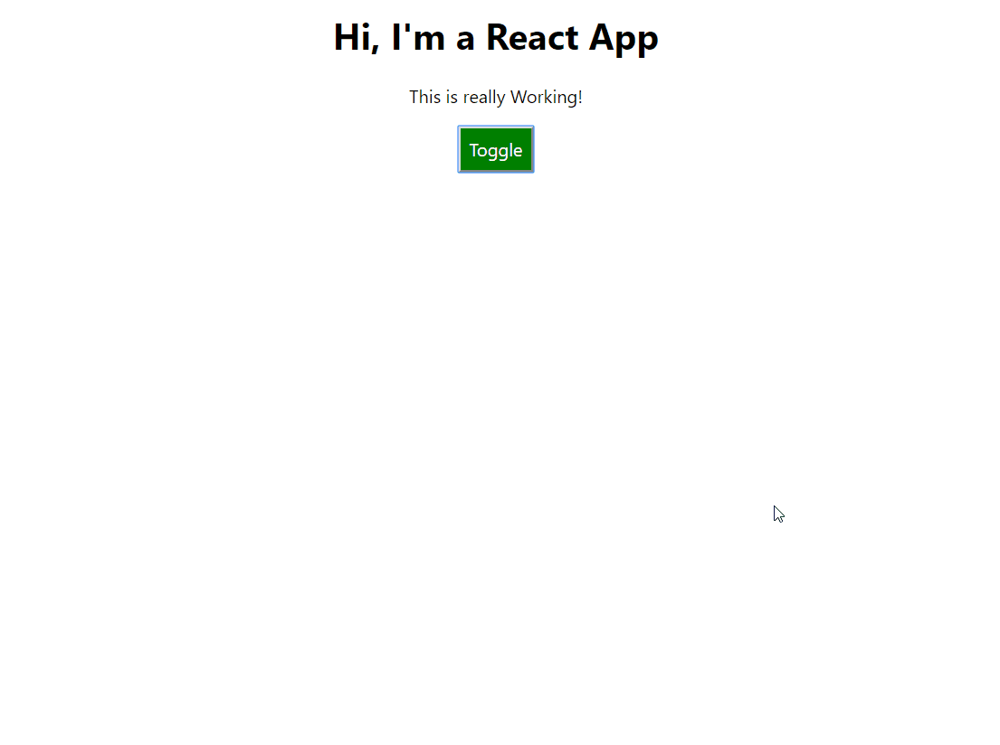

# Styling react

> Inline에서 CSS를 적용하는 것 만으로는 한계가 있다.

```javascript
const style = {
    backgroundColor: 'white',
    font: 'inherit',
    border: '1x solid blue',
    padding: '8px'
}

style={style}
```

- 물론 해당 Component에 대해서만 CSS가 되는건 장점이다.
- inline style이라 hover 이런거 어떻게 하지? 또, 동적으로 Style을 바꾸고 싶으면 어떻게 하지? 알아보자.


### Change CSS Conditionally

```javascript
if(this.state.showPerson){
    style.backgroundColor = "red";
}
```

- 가장 손쉬운 방법은 inline Style 객체를 return하기 전에 조건문으로 값을 바꿔주는 것이다.


### Change className Dynamically

```javascript
let classes = [];
if(this.state.persons.length <= 2) classes.push('red');
if(this.state.persons.length <= 1) classes.push('bold');

<p className={classes.join(' ')}>This is really Working!</p>
```

- className도 변수처럼 사용하여 조건에 따라 변경되게끔 만들어주면 된다.


### Radium : React Inline Styling Library

- CSS에 hover 같은 pseudo selector을 설정하자니 global하게 적용될까봐 걱정이다.
- 여전히 컴포넌트 단위로 style을 inline에서 해주는건 좋은 특성이다.
- Radium 패키지를 사용해보자.


```javascript
import Radium from 'radium';
export default Radium(App);
```

radium을 import 하고, 적용시키려는 컴포넌트에 Radium을 감싸주면 적용할 수 있다.


- Pseudo Selector를 inline styling 에 적용하기

```javascript
':hover':{
    backgroundColor:'lightgreen',
        color: 'black'
}
```

pseudo selector 들은 왼쪽처럼 quotation으로 감싸주고 사용하면 된다.




### Using media Queries

- Radium을 사용하되, StyleRoot으로 전체를 감싸주어야 한다.

```javascript
import Radium ,{ StyleRoot } from 'radium';
return (
    <StyleRoot>
    	<jsx>
    </StyleRoot>
);
```

```javascript
const style={
    '@media (min-width: 500px)':{
        width:'450px'
    }
}
```


### Using CSS Modules -> eject가 되지 않아서 못했음.

- Radium을 사용하지 않고, CSS 모듈을 그대로 이용할 수 있다.


---------------------------------

### 어려운 점

- Media query가 뭔지 모르겠음.

- Eject가 대체 뭘 하는건지 모르겠음.