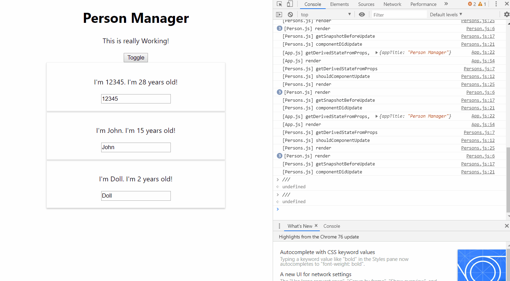
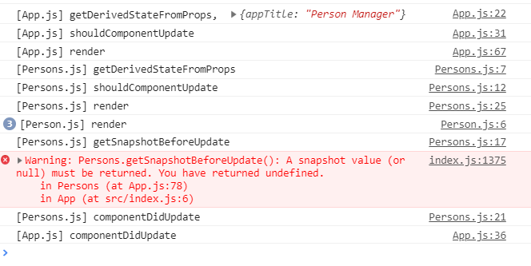

# Component Lifecycle (Updating)

> 컴포넌트를 업데이트 할 때의 Lifecycle 입니다.

### Component Lifecycle

>  Lifecycle이란 컴포넌트가 Mount되고, Update되고, Unmount 되는 일련의 과정을 의미한다.

#### Componenet Update시 실행되는 Hook의 순서

1. getDerivedStateFromProps
   - 변경된 Props에 대해 State를 Synchronize 해준다.
   - State Update하는 다른 방법이 있어, 이걸 잘 쓰지는 않는다.

2. shouldComponentUpdate(nextProps, nextState)
   - Update 할 게 없으면 update process 를 종료한다.

3. render()
   - render 후 virtualDOM 생성후 realDOM을 update 해준다.
   - 준비된 JSX code를 리턴한다.
4. child Components의 Props를 Update 한다.
   - 위와 같은 순서를 그대로 거친다.
5. getSnapshotBeforeUpdate(prevProps, prevState)
   - 이전 Props와 이전 State의 스냅샷을 저장
   - 거의 사용하지 않음. 
6. componentDidUpdate()
   - Update가 끝났을 때 실행되는 메소드
   - Side Effect를 수행한다.
   - synchronous 하게 State를 Update 해선 안된다.

#### 모든 Hook에 콘솔을 찍어본 결과

- 분명 Person 이라는 하나의 객체에 대한 props를 바꿧을 뿐인데 왜 상위 컴포넌트가 먼저 바뀌나
  - 지금 코드의 상황을 생각해봐야 한다.
    - Person은 input onchange시 Persons에게 받은 함수가 실행된다.
    - Persons가 Person에게 준 함수는 app.js의 nameChangeHandler이다.
    - app.js의 nameChangeHandler가 실행되면, app.js의 state가 변경된다.
    - state가 변경될 시 app.js의 Update Lifecycle이 시작되므로, 가장 먼저 app.js의 getDerivedStateFromProps 가 시작되고, 하위 component들의 update가 Trigger 되는 것이다.
- getDerivedStateFromProps -> shouldComponentUpdate -> render -> childComponent render -> getSnapshotBeforeUpdate -> componentDidUpdate 순으로 실행되는 것을 볼 수 있다.

#### App.js에도 찍어본 결과

- 결국 순서는 위에서부터 아래로 갔다가 다시 위로 올라오는 형태이다.

#### 중요한 점

- 가장 중요한 건 shouldComponentUpdate 이다.
  - Component를 Update 할 필요 없는데 굳이 하여 Performance를 떨어뜨리게 되는 경우를 방지하기 위해서이다.