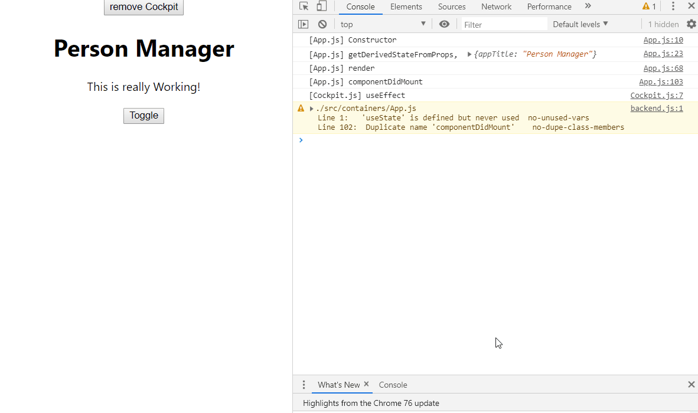

# Optimization


#### 해당 컴포넌트의 변경이 없는 경우 최적화

```javascript
shouldComponentUpdate(nextProps, nextState){
    console.log("[Persons.js] shouldComponentUpdate");
    if(nextProps.persons !== this.props.persons){
        return true;
    }
    else{
        return false;
    }
}
```

현재 props와 이전 props를 비교하여 동일하면 true, 다르면 false를 리턴한다. 

단순히 pointer를 비교하는 shallow comparison 인것 같은데 왜 작동하냐? 

```javascript
const persons = [...this.state.persons];
persons[personIdx] = person;
this.setState(
    {persons : persons});
}
```

이와 같이 새로운 persons를 아예 정의하여 사용하였기 때문이다.

그냥 persons를 modify하는 식으로 하였으면 비교가 안되었을 것이다.




- Toggle 후 cockpit을 제거할 시, 실제로 Persons는 변경되지 않는다.
- App.js의 this.state.Persons가 Persons의 props.persons로 들어오는 상황이므로, nextProps.persons와 this.props.persons를 비교해준다.
- 같을 경우 false를 리턴하므로, Persons를 Update하지 않는다.
- 고로 자연스럽게 하위 컴포넌트들에 대해서도 Update되지 않는다.
- 이를 이용하여 불필요한 렌더링을 최소화하여 최적화한다.


#### Functional Components 에서의 Optimization

```javascript
export default React.memo(Cockpit);
```

React.memo 메소드는 입력 컴포넌트의 변경이 없을 시 해당 컴포넌트를 다시 렌더링하지 않게 만드는 역할을 한다.

그래서 export 하는 functional Component를 React.memo 함수로 감싸주면, Component가 update 되었는지 아닌지를 판단해준다.


### When To Optimize?

모든 component들을 extra check 하게 되면 그것 또한 낭비다. 가령 대부분 상위 컴포넌트의 변경이 하위 컴포넌트의 변경을 야기하게 된다면, 굳이 체크할 이유가없다.


### PureComponent

PureComponent는 모든 입력되는 props들에 대한 shouldComponentUpdate 함수가 이미 구현되어 있는 컴포넌트이다. 

```javascript
shouldComponentUpdate(nextProps, nextState){
    console.log("[Persons.js] shouldComponentUpdate");
    if(nextProps.persons !== this.props.persons ||
       nextProps.changed !== this.props.changed ||
       nextProps.clicked !== this.props.clicked){
        return true;
    }
    else{
        return false;
    }
}
```

이런식으로 존재하는 모든 props에 대한 변화를 체크하고 싶으면 차라리

```javascript
class Persons extends PureComponent{
```

이렇게 Person을 정의하자. 이미 다 구현되어 있어서 코드를 복잡하게 할 필요가 없다.