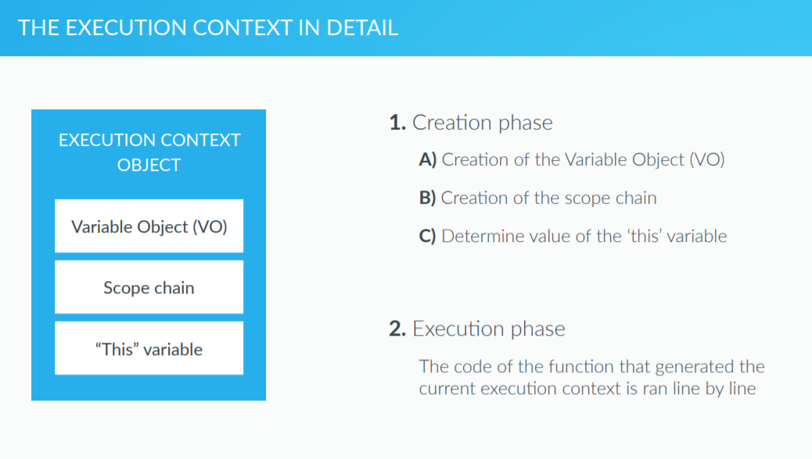
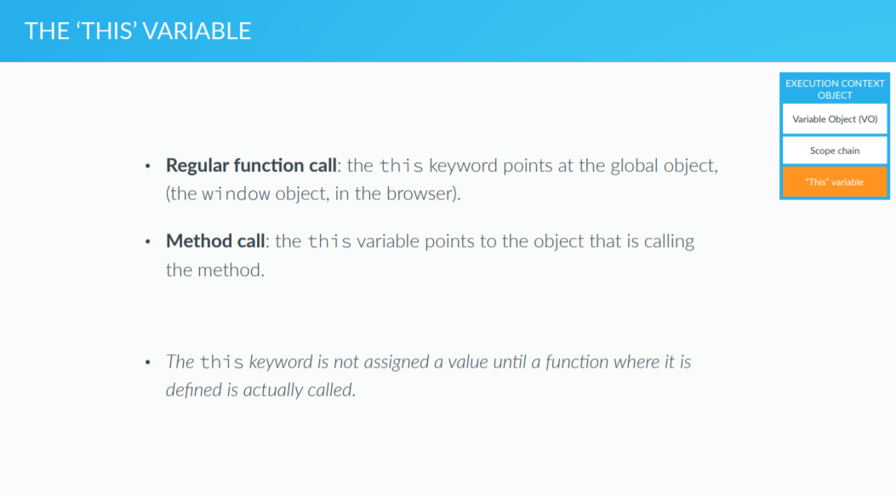

# How JavaScript Works


### **Execution Contexts**


- Execution Context란 프로그램이 실행될 때 생성되는 변수를 저장하는 변수공간이다.
- 시스템에 기본적으로 Global Execution Context가 존재한다.
- 어떤 함수 안에 있지 않은 코드는 모두 Global Execution Context에 담기게 된다.
- ex) 전역변수 설정시, Browser로 구동시 해당 변수는 window의 property가 된다.

<br>

**Example**


- 예시 코드에서, 함수가 새로 호출될 때 마다 Execution Stack에 해당 함수의 Context가 push된다.
- 각 변수는 해당 context의 property이므로, 해당 변수를 호출 할 시 현재 Context로부터 아래로 내려가면서 찾는다.




EC의 생성 순서

1. Variable Object 를 먼저 생성
2. scope chain 생성
3. this variable의 값 결정

생성된 후엔 함수 내의 코드가 실행된다.<br>


Variable Object 생성시 순서

- 함수에 input으로 들어온 변수를 담는 argument 라는 object 생성
- function 내 function declarations 찾아서 함수 정의
- function 내 variable 찾아서 선언 후 undefined 할당
- 밑의 둘을 합쳐서 Hoisting 이라고 한다.<br>

### Hoisting

- 함수 선언문은 처음부터 정의되므로 어떤 위치에서든 실행 가능하다.

```javascript
calculateAge(1965); // works
function calculateAge(year) {
    console.log(2016 - year);
}
```

- 함수가 실행 될 때, 함수 내에 선언된 변수는 가장 먼저 선언된다.

```javascript
var age = 20;
function foo() {
    console.log(age); // undefined
    var age = 65;
    console.log(age);
}
foo(); // undefined , 65
(function(){console.log(age)})(); // 23
```

위 코드에서 age가 undefined로 출력된 이유는 foo()가 실행된 후 age가 함수 내에서 재 선언되었기 때문이다.

- 함수 표현식은 변수정의만 호이스팅되고 함수 자체는 할당되지 않는다.

```javascript
retirement(1965) // error : cannot call undefined
var retirement = function(year) {
    console.log(65 - (2016 - year));
}
```

함수 표현식은 호이스팅으로 retirement = undefined 되므로 함수를 할당하지 않은 상태에서 호출한 꼴이 된다.<br>

### Scope


Scope 형성시

- 각 function은 scope를 형성, 해당 scope는 접근할 수 있는 변수를 가질 수 있음
- JavaScript에서 scope는 오직 함수만이 설정할 수 있다.
- **Lexical scoping**  : 위치상 안에 있는 함수는 바깥 함수의 변수에 접근할 수 있다.


 위 그림의 예시와 같이 함수가 함수를 포함하는 상황에서, 가장 안쪽에 있는 함수는 바깥의 모든 함수의 변수들에 접근할 수 있게 된다.


- **Execution Stack과 Scope Chain은 같지 않다**


- Execution Stack은 호출된 함수의 순서로 이어지고
- Scope Chain은 함수가 선언된 위치에 의해 순서가 결정된다.
- 위 코드는 에러가 발생하는데, third()의 Scope에서 second()의 c가 정의되지 않았기 때문이다.


### **this variable**



- **this** variable은 현재 Object를 가르키는 keyword이다.
- Global Scope에서 정의가 되었다면 this == windows 일 것이다.
- 특정 Object에서 선언이 되었다면 해당 Object의 Scope에 있는 변수를 this.property 로 접근 가능하다.


**example**

```javascript
calculateAge(1985);
function calculateAge(year) {
    console.log(2016 - year);
    console.log(this);
}
```

여기서 this는 windows를 가르킨다. 그래서 출력하면 이상한 뭔가가 줄줄이 나올 것이다.

```javascript
var john = {
    name: 'John',
    yearOfBirth: 1990,
    calculateAge: function() {
        console.log(this);
        console.log(2016 - this.yearOfBirth);
        
        function innerFunction() {
            console.log(this);
        }
        innerFunction();
    }
}

john.calculateAge();

var mike = {
    name: 'Mike',
    yearOfBirth: 1984
};


mike.calculateAge = john.calculateAge;
mike.calculateAge();
```

위 예시는, john이란 Object에서 calculateAge라는 property에 함수를 할당하고, 해당 함수 안에 innerFunction을 두었다. 

여기서 함수 john.calculateAge의 this는 john을 가르키지만, **그 함수의 innerFunction은 john을 가르키지 않기 때문에**, this는 john이라는 object를 포함하는 object를 의미하게 된다.

