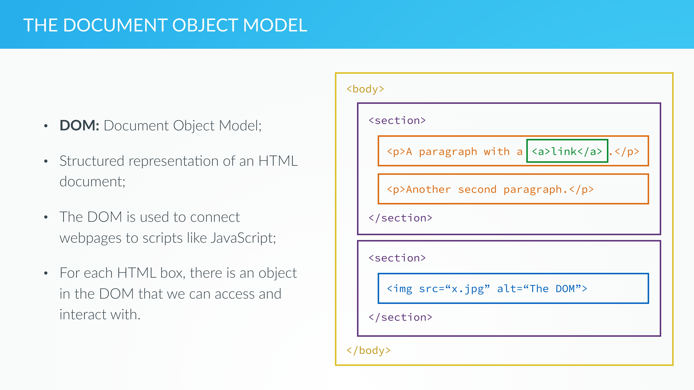

# DOM manipulation and Event


### DOM(Document Object Model)



- DOM은 web과 script language를 연결하는 역할을 한다.
- 각 HTML box마다 상호작용 할 수 있는 Object DOM이 있다.


### DOM manipulation example

```html
<div class="player-current-score" id="current-0">0</div>

```

위의 HTML을 manipulate 하는 Javascript code

```javascript
var dice = Math.floor(Math.random() * 6) + 1;
document.querySelector('#current-'+activePlayer).innerHTML = '<em>' + dice + '</em>'; // textContent는 text 그대로, HTML넣으려면 innerHTML
document.querySelector('.dice').style.display = 'none'; // class 가져와서, 해당 style.display 없애기 가능. style은 해당 DOM의 CSS에 접근한거고, display는 안보이게 한거고.
```

- document.querySelector() : 입력한 id에 해당하는 DOM 객체를 리턴한다.
- innerHTML 메서드는 해당 HTML을 리턴.
- .style은 해당 DOM의 CSS에 접근한거고, display값을 위와 같이 변경할 수 있다.


### Events and Events Handling


- Event : webpage에서 발생한 것들이 code에 전달되는 것들
- Event_listener : 특정 이벤트 기반으로 작동하는 함수 (특정 event가 실행되길 기다림) 


- Execution Stack 뿐만 아니라 Message Queue도 있는데, Browser에서 작동된 Event들을 저장하는 큐이다.
- Execution Stack이 비게 되면, Message Queue에 있는 Event들이 동작하는데, 이는 곧 해당 EventListener를 동작시키는 것이 된다.
- 해당 EventLister도 Execution Context가 개별적으로 존재하며, 실행시 Execution Stack에 Execution Context를 쌓는 방식으로 똑같이 실행된다.


### 실습

```HTML
<button class="btn-roll"><i class="ion-ios-loop"></i>Roll dice</button>
```

- 위와 같이 버튼을 정의하고, 이 버튼을 눌렀을 때 주사위를 굴려서, 굴린 주사위의 사진이 나오게끔 하는게 목표이다. 

- 우선, querySelector를 이용하여 해당 Class를 가져오고, 그 Class에 EventListener를 추가해주자.

  ```javascript
  document.querySelector('.btn-roll').addEventListener('click', btn) 
  ```

  - [Event reference](https://developer.mozilla.org/en-US/docs/Web/Events)에 어떤 event가 있는지 확인할 수 있다.-
  - addEventListener에 첫번째 인자로 event를, 두번쨰 인자로 Callback 함수를 넣는다.

- EventListener를 추가한 후, 해당 EventListener가 동작할 때 수행할 함수를 정의하자

  ```javascript
  function btn(){
      var dice = Math.floor(Math.random() * 6) + 1;
      var diceDom = document.querySelector('.dice');
      diceDom.style.display = 'block'; // block 영역으로 보이게 만든다.
      diceDom.src = 'dice-' + dice + '.png';
  }
  ```

  - 물론 btn은 나중에 쓸일이 없으니 애초부터 임시함수로 정의해서 넣어도 된다

    ```javascript
    document.querySelector('.btn-roll').addEventListener('click', ()=>{
        var dice = Math.floor(Math.random() * 6) + 1;
        var diceDom = document.querySelector('.dice');
        diceDom.style.display = 'block'; // block 영역으로 보이게 만든다.
        diceDom.src = 'dice-' + dice + '.png';
    }) 
    ```

- QuerySelector가 아닌 getElementbyID를 사용하면 ID로 빠르게 가져올 수 있다.

  ```javascript
  document.getElementById('score-0').textContent = '0';
  document.getElementById('score-1').textContent = '0';
  ```

- 새로운 데이터를 render 해주고 싶으면 결국 Element나 query를 가져와서, 매번 갱신해주어야 한다.
