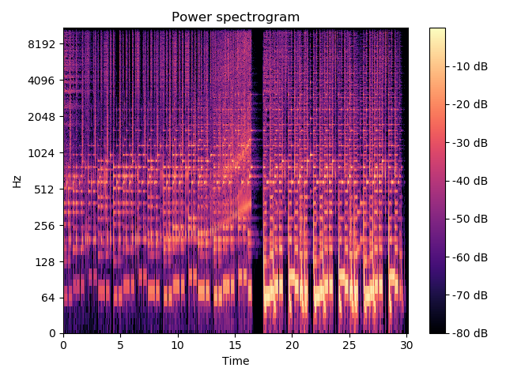

# Librosa 

- Study of Librosa
- For Project Hanium

### 0. Tutorial

- 설치
```shell
pip3 install librosa
```
- 음원 파일 읽어들이기
```python
import librosa
File = '../Music/Kissin.mp3'
y, sr = librosa.load(File)
```
이때 그냥 이렇게 읽어들이면 **audioread.NoBackendError** 가 발생한다. 이는 FFmpeg가 설치되어 있지 않기 때문에 발생하는 문제이다.

이를 해결하기 위해선 [여기](https://ffmpeg.zeranoe.com/builds/)에 접속하여 본인 OS에 맞는 빌드를 설치한 후, 적절한 장소에 폴더를 옮긴 후 bin 폴더를 PATH에 설정하면 된다. (윈도우는 재부팅 후 PATH 설정이 완료되므로 PATH 설정 후 꼭 껏다 켜주자.)

파일을 읽으면 y와 sr 변수에 나누어 저장되는데, sr은 sampling rate이다. y는 음성의 시계열 데이터이다.

### 1. STFT & Spectrogram

- STFT에 대한 기본 개념은 [여기](https://github.com/riverandeye/Investment/tree/master/Engineering/Fourier_Transform) 에서 찾으실 수 있습니다.

```python
# read file
File = '../Sample/mp3/Puzzle/Puzzle.mp3'
y, sr = librosa.load(File)
D = np.abs(librosa.stft(y))
```

librosa.stft(y) 는 complex value를 리턴하므로, np.abs를 통해 amplitude 형식으로 변경해 준다. (np.angle을 적용하면 각 시점마다 해당 frequency의 phase를 알려주지만, 아직 그걸 이용해서 뭔갈 하는 방법은 잘 모르겠음.)


```python
import librosa.display # 가끔씩 import 오류가 발생해서 그냥 명시해주자.
#draw spectrogram
librosa.display.specshow(librosa.amplitude_to_db(D, ref=np.max),  y_axis='log', x_axis='time')
plt.title('Power spectrogram')
plt.colorbar(format='%+2.0f dB')
plt.tight_layout()
plt.show()
```

STFT 결과를 spectrogram으로 나타내면 이러한 이미지가 나온다.



가로축은 실제 음원의 시간, 세로축은 해당 시간에 발생한 신호의 주파수와 Amplitude가 데시벨에 따른 색깔로 구분되어 있다. 밝은 색깔일수록 해당 시점에 의도한 주음일 가능성이 높다.


### Reference

- 