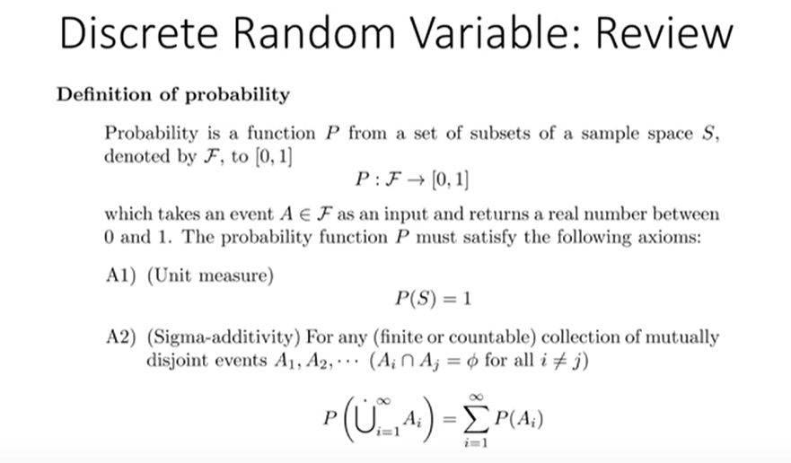
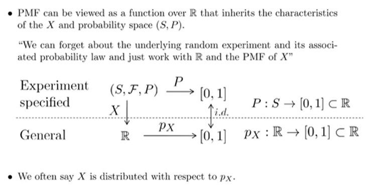
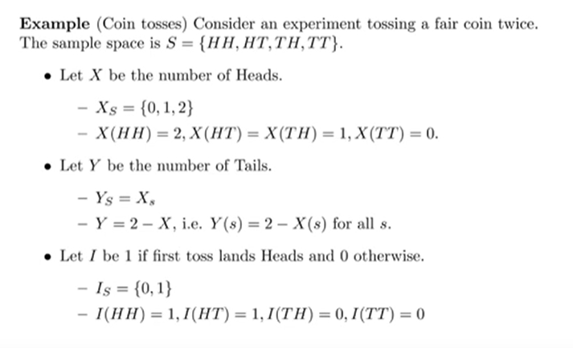

# Information and Inference

> 정보 이론

### Introduction

- Information, 정보 이론에 대해서 배운 다음에, 그걸 바탕으로 Inference, 추론을 할 것임.
- random variable (확률적 정보) 속의 quantity가 information
  - 1만 나오면 deterministic
  - 어느정도 random 하면 -1 0.1 ~ 등 다음에 어떤 숫자가 나올지 모를 정도로 다름.
  - 다음께 전혀 뭔지 모를 때 정보가 없다? 그게 아니다. 
    - 1만 나오면 더이상 알 필요가 없다.
    - 랜덤하게 나오면 등장에 대한 기술이 필요하다.
  - 랜덤한 것들은 pdf (probability density function), discrete 한 경우엔 probability mass function 에 의해 기술된다.
  - pmf 혹은 pdf 자체가 어떠한 정보를 가지고 있고, 어떤 의미인지를 나타낸다.
- 전반부엔 이러한 'random variable'속의 quantity (pmf, pdf) 들에 대해 배움
- 후반부엔 이들을 이용하여 우리가 알고싶은 것을 추론하는 방법에 대해 배움.

### Discrete Random Variable

 한정된 데이터들은 하나 둘 셋 넷 셀 수 있다. 셀 수 있는 것들은 discrete 하다. 

**단순한 프로그램만 짜는것보단 확률과 통계 밑바닥을 가지도록 하자.** 

**Probability의 정의**

Probability 는 **Sample space S 의 부분집합의 집합인 F에 대해서**, **입력으로 F의 원소를 받고** **출력으로 0과 1 사이의 real number를 반환하는 함수이다.**  Probability는 다음과 같은 성질을 만족해야 한다.

- Sample space를 입력으로 넣을 시(전체집합) 결과는 1이어야 한다 (Unit Measure)
- F의 모든 disjoint events들에 대해서 각 집합의 합의 확률은, 각 집합의 확률의 합과 같다. (Sigma-Additivity)
  - 합집합 기호 U 위의 점이 disjoint 함을 의미한다.

**Random Variable 의 정의**

- Random Variable X는 Sample space S 에서 real number R로 가는 **함수**. (real number는 )
- Xs 는 X의 range(치역), S에 포함된 원소 s에 대해서 X(s)는 R에 포함될 것이다 (X 자체가 S -> R 이니까)
- {X = x} 라는 건 X(s) = x 를 만족시키는 s 중 S에 포함되는 s의 집합을 의미한다.
  - real number가 1개여도 이를 만족하는 s는 여러개가 될 수 있음을 의미.
- {X <= x} 라는 건 X(s) <= x 를 만족시키는 s중에 S에 포함되는 s의 집합.

**Discrete Random Variable**

- Xs가 Discrete하면 X도 Discrete 하다고 함.

**Probability Mass Function**

PMF는 실수에서 0,1로 가는 함수이다. 

Probability는 P : F -> [0,1] 이다. F 는 S의 부분집합의 집합.

{X = x} 는 S의 원소 중 X(s)  = x 를 만족하는 s의 집합이다. 

그럼 {X = x} 또한 Probability의 입력이 될 수 있고, 그 결과 또한 [0, 1] 사이의 실수일 것이다.

**곧 x를 만족하는 s의 집합은 [0,1]에 대응하므로, x가 [0,1]에 직접 대응할 수 있게 되는 것이다.**

이를 px(x)로 표현하고 Probability Mass Function 이라고 부른다.

- (Discrete 한 상황)

**PMF는 실수에서 [0 - 1] 로 가는 함수**인데, S, F, P의 Probability Structure를 모두 보존하고 있다. 결국 신경써야 할 것은 R -> [0,1] 만 신경쓰면 된다. Sample Space가 어떻게 됐고, 관련된 probability law에 대해 신경쓰지 않아도 되고, R과 X의 PMF 만 생각하면 된다.

결론적으로는 **X는 px라는 distribution 을 따른다** 라고 이야기 하면 된다. PMF만 알면 된다.

### Example

S의 부분집합은 2의 4승, 16개. 

만약 X를 "주사위 2개에 대한 Head의 갯수"로 정의를 한다면, Xs 는 {0,1,2}가 될 것이다.

Y를 "주사위 2개에 대한 Tail의 갯수"로 정의한다면, Y = 2 - X 가 될 것이다. 

I를 "주사위 2개에 대한 First toss lands 일때 1, 아닐때 0"으로 정의한다면 Is = {0,1} 이 될것이다.

fair coin이기 때문에 HH HT TH TT 각각이 등장할 확률은 1/4 로 동일하다.

X(HH) = 2,  X(HT) = 1, X(TH) = 1, X(TT) = 0 이므로

px(0) = P(X = 0) = P({s | X(s) = 0}) = P(TT) = 1/4

px(1) = P(X = 1) = P({s | X(s) = 1}) = P(TH) + P(HT) = 1/2

이런식으로 구해진다.

