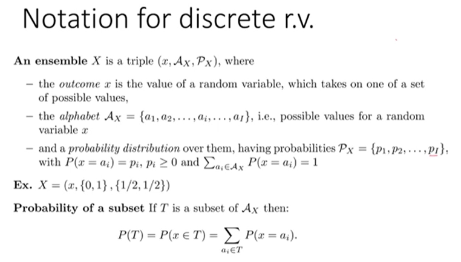
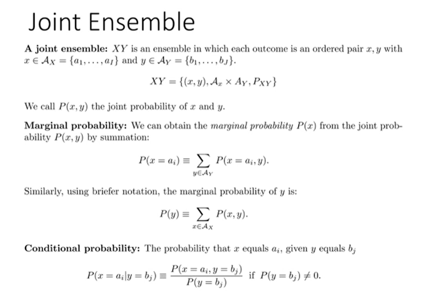
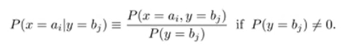
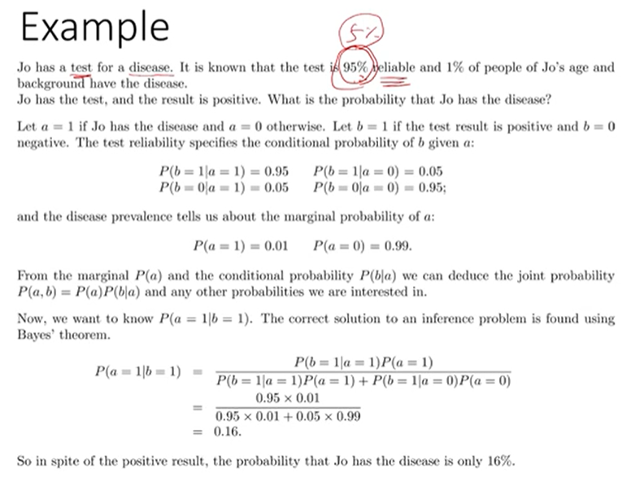

# Information Theory Lec 2

> 정보이론 2일차 강의

### Review

PMF : 실수에서 0-1로 가는 함수, Probabilitic한 Structure를 그대로 갖고 있음.

Xs = subset of sample space S

px(x) : P({X = x})

**Ensemble X** : Exactly Discrete Random Variable

- x, Ax, Px (random variable, Range of X, Probability of X (PMF))
  - x 는 그냥 x
  - Ax는 Range of X.
  - Px는 Px = { p1, p2, ... pI} 임. P(x = ai) = pi 이면서  모든 Range를 더했을때 1인 distribution 이어야 함.
- 이 모든 것을 다 합쳐서 Ensemble 이라고 함. 
  - X = {x, {1,2,3,4,5,6}, {1/6,1/6,1/6,1/6,1/6,1/6}} 이게 Ensemble
- Subset의 확률은, 해당 Subset의 Element의 Probability의 합이다.

굳이 Discrete Random Variable 정하지 말고 Ensemble만 생각하면 편함.

**Random Variable은 절대 하나만 있지 않다.**

**Joint Probability** XY = {(x,y), Ax * Ay, Pxy} 

- (x,y) - random variable pair

- Ax * Ay - Cartesian Product of each Range of x,y

- Pxy - Joint Probability Distribution Function (PDF)

  - Joint PDF를 구하기는 힘들다. Joint Probability를 안다는 건 모든걸 안다는 것 과 같다.

  - Joint PDF를 알기 위해서 여러 방법을 쓴다.

    

**Marginal Probability**

- Joint Probability를 알면, 각 random variable이 1개 있는 경우인 Probability를 알아낼 수 있다.

- Joint Probability를 통해 알아낸 Single variable의 Probability를 Marginal Probability 라고 한다.

  

**Conditional Probability** (조건부 확률)

- y가 bj일때 x가 ai일 확률을 기술할때 다음과 같이 한다.

  

- 뒤의 조건을 evidence라고 칭한다.
- P(x = ai) 라는 확률을 이미 안다고 가정할 때, 이를 Prior Probability 라고 한다. (경험 이전의 선험적인 확률)
- 현실은 Joint 한 경우가 더 많다. P(x = ai | y = bj) 가 더 많다. y = bj 일 때 (evidence) x = ai 가 될 확률.

- y=bj 가 벌어져야 고려 하는데, 그게 0이라면 Conditional Probability를 정의할 수 없으니 0이되면 안되겟죠.
- P( x = ai | y = bj) * P(y = bj) = P(x = ai, y = bj) 이건 Chain Rule

예시를 딱 봤을 때 XY Ensemble을 바로 유추할 수 있겠죠! 직접해보세요!

#### **Bayes Theorem**

- Bayes 는 엄청난 천재
- **Heart of Bayesian Inference**

Bayesian식 에서 H는 condition이 없을 수는 없다는 걸 명시하기 위해 General 하게 작성한 것이다.

**Product Rule**

- **Conditional Probability** 로부터 유도된 식

**Sum Rule**

- Marginal Probability 와 같은 내용이다. 거기에 단순히 Product Rule을 적용한 것

**Bayes Theorem**

- Product Rule을 x와 y 위치 바꿔서 하나 분모로 내리면 저렇게 됨.
- 분모는 그냥 거기에 Sum Rule을 적용한 것.. 
- 이 식을 어떻게 받아들이냐가 가장 중요하다.
- 결과를 보고 원인의  

**Independence**

- 확률이 Independent 하다 -> 두 사건의 곱이 두 사건의 교집합의 확률인 경우.
-  독립이라는 사실을 알면, Marginal 들을 갖고 Joint를 구할 수 있게 된다.

Jo가 질병 검사를 하는데, 이 질병 검사의 신뢰도가 95% 라고 하고, Jo의 나이의 1% 정도가 질병에 걸린다고 한다. Jo가 test를 봤는데 결과가 positive라고 한다. Jo가 진짜로 병에 걸렸을 확률이 어떻게 되는가?

**Jo의 나이대에 걸릴 확률이라는 Prior**가 제공된 상황이다.

a = 1인 것이 Jo가 병에 걸렸다는 것, b = 1이 Test Result가 positive임을 명시하는 확률변수 라고 가정하자. 이때 Prior Knowledge에 의해 P(a=1) = 0.01, P(a=0) = 0.99 이다. 

우리가 알고 싶은 건 현재 상황, 즉 P(a=1 | b=1), **Test Result가 Positive일 때 Jo가 병에 걸렸을 확률**을 판단하는 것이다. Test Result의 Reliability를 토대로 우리가 원하는 경우의 반대 상황에 대해 계산을 할 수 있을 것이다.

P(b=0 | a=0) => Test를 맞춘 경우의 확률 : 0.95

P(b=1 | a=1) => Test를 맞춘 경우의 확률 : 0.95

P(b=0 | a=1) => Test를 맞추지 못한 경우의 확률 : 0.05

P(b=1 | a=0) => Test를 맞추지 못한 경우의 확률 : 0.05

P(a=0) => 0.99

P(a=1) => 0.01 

Bayesian Rule을 이용해서 결과를 구해보자.

P(a = 1| b=1) = P(b = 1 | a = 1) * P(a =1)  /  ( P(a = 0 | b = 1) * P (a = 0) + P(a = 1 | b = 1) * P (a = 1) ) 

간단하다.

