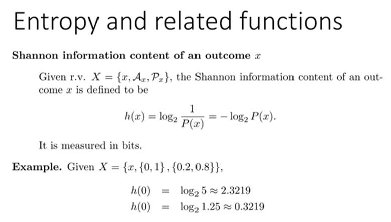
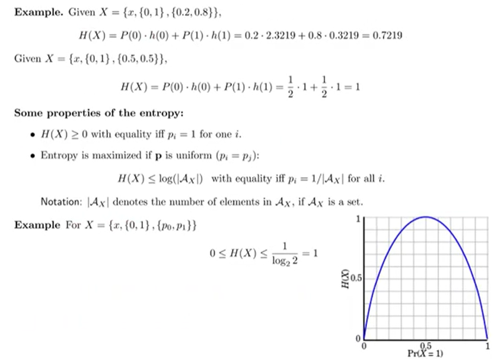
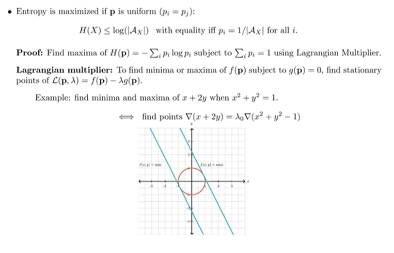
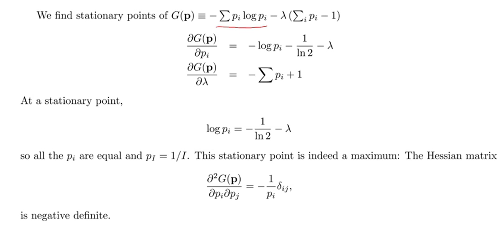

# Information Theory Lec 3

> 정보이론 3일차 강의

### Intro

- 정보이론은 Entropy와 관련된 개념을 공부
- 처음 시작은 Claude Shannon - 정보 이론이라는 학문 분야를 만듬. Random variable을 Information 이라는 관점에서 다룸.

다음과 같이 Random Variable X가 Ensemble 형식으로 주어졌다고 할 때, 각각의 outcome에 대해서 **Information content** (정보량) 을 정의한다.

동전을 던지는 경우라고 생각하고 H, T , 각각의 Ah, At = 1/2 라고 쳐보자. 이때 h(H) = log_2 2 니까 1이다.

의미를 생각해보자.

- Probability에 역수를 취한다는건, 확률이 작을수록 큰 값이 나온다는 것. **확률의 역수는 Surpriseness 에 비례하다.** 

Random Variable이 정의되었을 때, 해당 Random Variable의 Entropy를 정의할 수 있다. 사실 Shannon이 정의한 Entropy랑 볼츠만이 정의한 Entropy는 그 과정이 매우 유사하다고 한다.

**특정 확률 변수를 대표하는 Information Content는, 각각의 Information Content의 기댓값이다.** 

- 애는 Outcome에 관한 값들은 관련이 적고, 확률 자체에 관련이 있다. 
- 그래서 probability vector에 대한 식이기도 하여 저렇게 표현한다.

Entropy of X를 X의 불확실성 (uncertainty) 라고 하기도 한다.

surpriseness를 표현하는데 필요한 자릿수의 bit의 의미를 도입하여 log의 밑이 2인 것이다.

예시를 한번 보자. Information Content 각각 구해서 해당 Random Variable X의 Entropy를 구할 수 있겠다.

확률이 0.2, 0.8일 때보다 0.5 0.5일 때가 엔트로피가 더 높다. (Uncertainty가 더 높으니까.)

엔트로피의 성질들

- 엔트로피는 항상 0보다 크거나 같다. Entropy가 0인 경우는 p가 1이 되는 경우가 있을 때 (확정된 경우)
  - Entropy가 0이면 Random이 아니라 Deterministic 한거지.
- 확률이  서로 같을 수록 다이나믹한 것.
  - variable이 가질 수 있는 경우의 수가 많을수록, 엔트로피가 가질 수 있는 최댓값이 커진다.

P가 Uniform 할 때 Entropy가 최대화된다는 것을 증명해보자.

p는 Summation 시 1이 된다는 Constraint가 있고, 그런 Constraint 속에서 H(p)의 Maxima를 찾는 것이므로 라그랑주 승수법을 이용할 수 있다. 

Constraint 가 이고 최적해를 찾는 식이  이므로 라그랑주 승수법에 의해 를 만족해야 한다. 

 이를 만족하는 Stationary point p에 대하여 G(p) 를 저렇게 두고, pi에 대해 미분하면 다음과 같은 식이 나오는데, 이는 pi가 i의 값에 관계 없이 동일함을 의미한다.

Hessian Matrix를 통해 해당 Stationary Point가 음수임을 밝혔고, 이는 극점이 극대임을 의미한다. 그래서 결론은 pi가 모든 i에 대해 동일할 때 엔트로피가 최대가 됨을 증명하였다.

