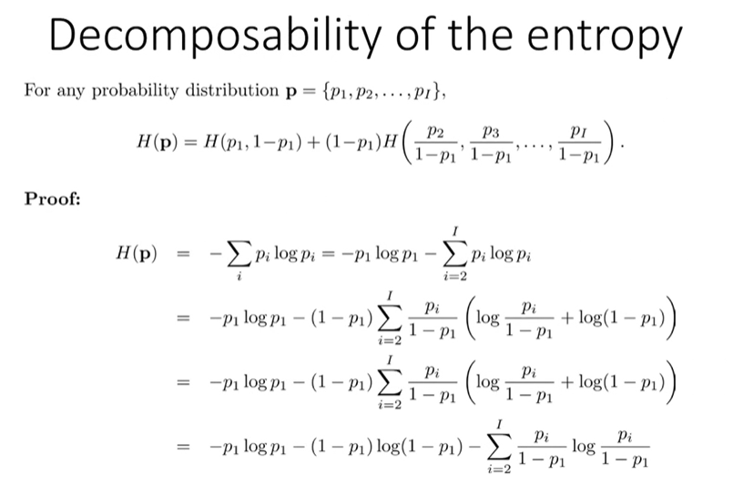
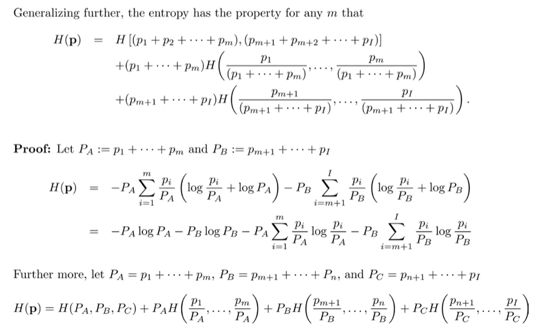
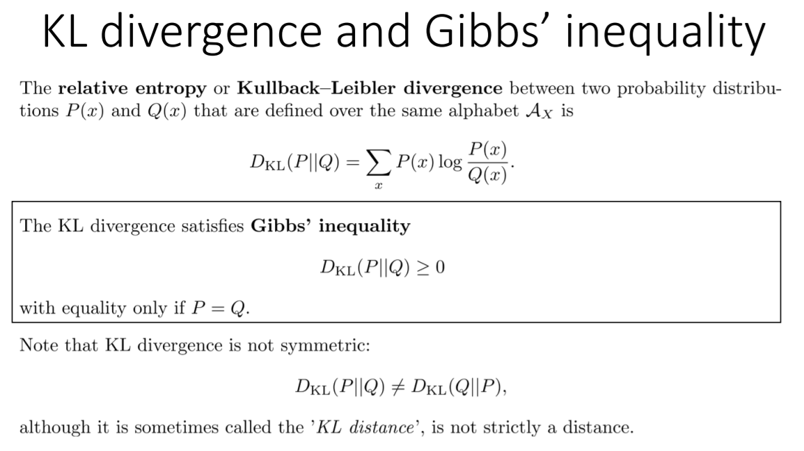

# Information Theory Lec 3

> 정보이론 4일차 강의

Ensemble X = { x , Ax , Px } 면 Px 자체를 Marginal 이라고 생각한다. XY = { (x,y), Ax x Ay , Pxy (x,y) }

우리가 Joint PDF 혹은 PMF 를 안다면, X,Y에 대한 Joint Entropy를 구할 수 있고, X와 Y가 Independent 한 경우, Joint Entropy는 Marginal Entropy의 합이 된다. (증명참고)

**Iff 라는 점을 미루어 보아, 반대 방향의 증명도 할 수 있을까?** 좀만 기다려보자.

 위의 식은, prob distribution에 대해 **하나의 p1과 그 역에 대한 pdf라고 생각하고 Entropy의 합을 구한 후,** **나머지에 대한 부분의 Entropy를 모두 더한 후 역의 확률과 곱하여 구할 수 있다**는 것임. 

위 식을 좀 더 Generalize 하면 다음과 같이 작성할 수 있다.

굳이 하나로만 분리하지 않아도 여러개로 분리하여 작성할 수 있다는 것임. 분리된 확률들을 원래 확률의 가중치를 곱해서 더하면 끝이다.

예시를 보면 쉽게 이해가 됨. 저런식으로, 비슷한 것들 끼리 묶어서 계산을 쉽게 할 수 있다. 우리가 가장 간단하게 알고 있는 것이, 확률이 같은 경우  (n = 변수의 갯수) 이니까 단순하게 묶어서 계산한 것.

