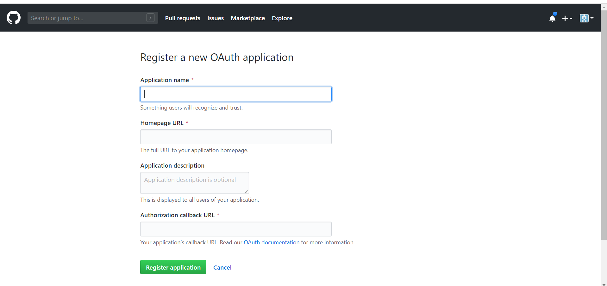
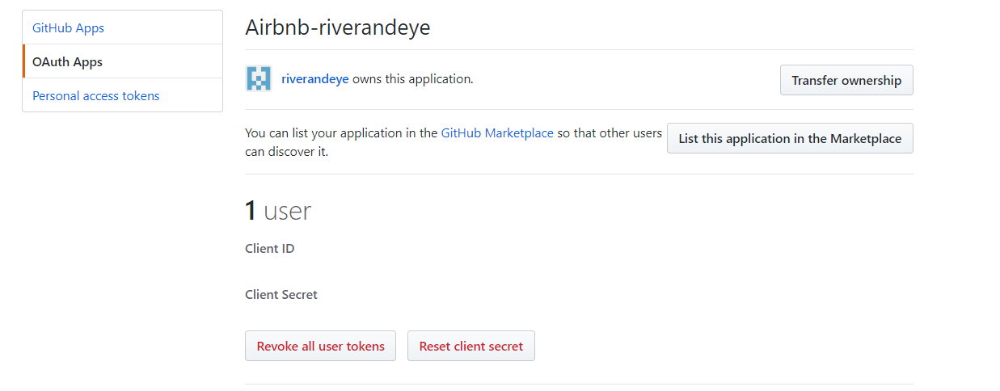
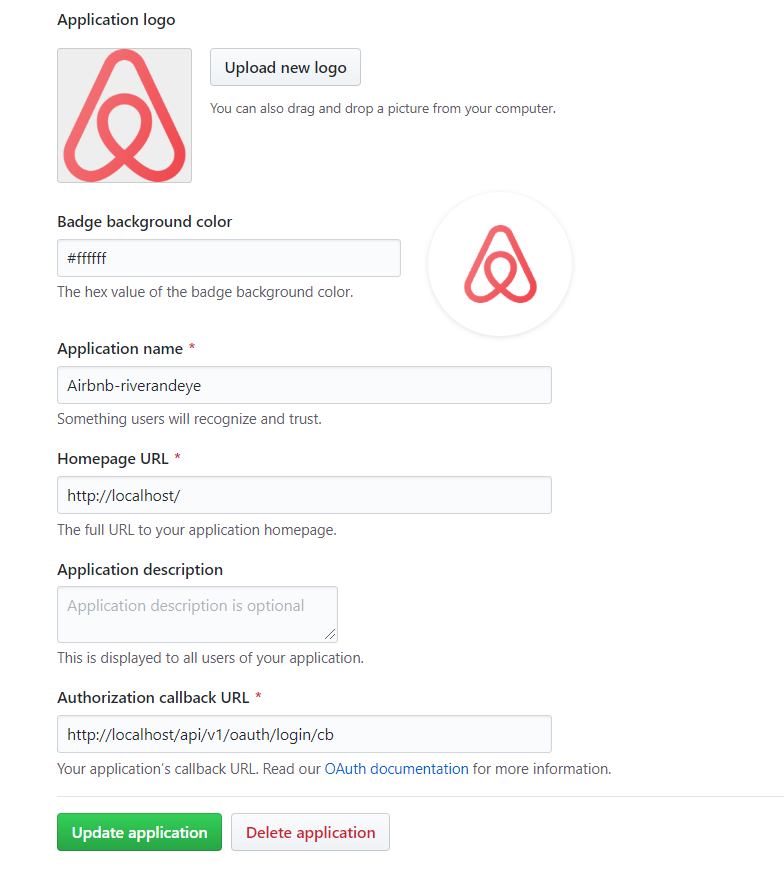

# Oauth github

> Github에서 Oauth를 사용하는 절차에 대해 알아보자.


#### Github Oauth Apps 만들기

우선 Oauth를 위한 App 을 하나 만들어보자.

`우상단 > Setting > 좌측 Bar의 Developer setting > 좌측 Bar의 OAuth Apps > New OAuth App  `




앱을 생성하고 나면 Oauth Apps에서 해당 앱을 조회할 수 있고, 




생성된 App에 대한 Client ID와 Secret 번호를 확인할 수 있다.




앱의 로고와 이름, 홈페이지 URL, Authorization 요청 성공시 콜백할 URL을 입력할 수 있다.


#### User

깃헙에 Oauth를 이용하여 로그인하여 로그인한 사용자의 public 정보를 이용해보자. 


**1. Resource Owner에게 authorization 요청하기**

github에서 authorization 요청은 항상 위 양식의 주소로 신청한다.

`https://github.com/login/oauth/authorize?client_id=${process.env.CLIENT_ID}`

여기서 process.env.CLIENT_ID 는 앱 설정에서 확인되는 ID를 작성해준다.


**2. Authrization Grant 받기**

authorization grant를 받으면 위에 app에서 작성된 콜백 url으로 쿼리가 전달된다. 

```javascript
OAuth.get('/login/cb', async (req, res, next) => {
  const AuthorizationToken = req.query.code; // Authorization Token
```

nodejs에서 req.query.code로 해당 Authorization Token이 전달된다.


**3. Authorization Grant를 전달하여 Access Token 받기**

```javascript
const response = await axios({
    method: 'post',
    url: `https://github.com/login/oauth/access_token?client_id=${process.env.CLIENT_ID}&client_secret=${process.env.CLIENT_SECRET}&code=${AuthorizeToken}`,
    headers: {
      accept: 'application/json'
    }
  });
const AccessToken = response.data.access_token;
```

client_id 와 client_secret를 쿼리 단에 입력해주고,  AuthorizeToken을 입력해준다. response.data 객체 안에 access_token 프로퍼티로 토큰을 받을 수 있다.


**4. Access Token으로 resource server에 접근하여 private resource 받기 **

```javascript
const response2 = await axios({
    method: 'get',
    headers: {
        Authorization: `token ${AccessToken}`
    },
    url: `https://api.github.com/user`
}).catch(e => {
    console.log(e);
});
```

AccessToken을 get 방식으로 user api에 요청하면 사용자 정보를 json 형태로 받을 수 있다.


#### Reference

[Medium 글](https://medium.com/shriram-navaratnalingam/authentication-using-github-oauth-2-0-with-nodejs-be1091ce10a7)

[github API 명세]( https://developer.github.com/v3/ )

[github Oauth 튜토리얼](https://developer.github.com/apps/building-oauth-apps/)